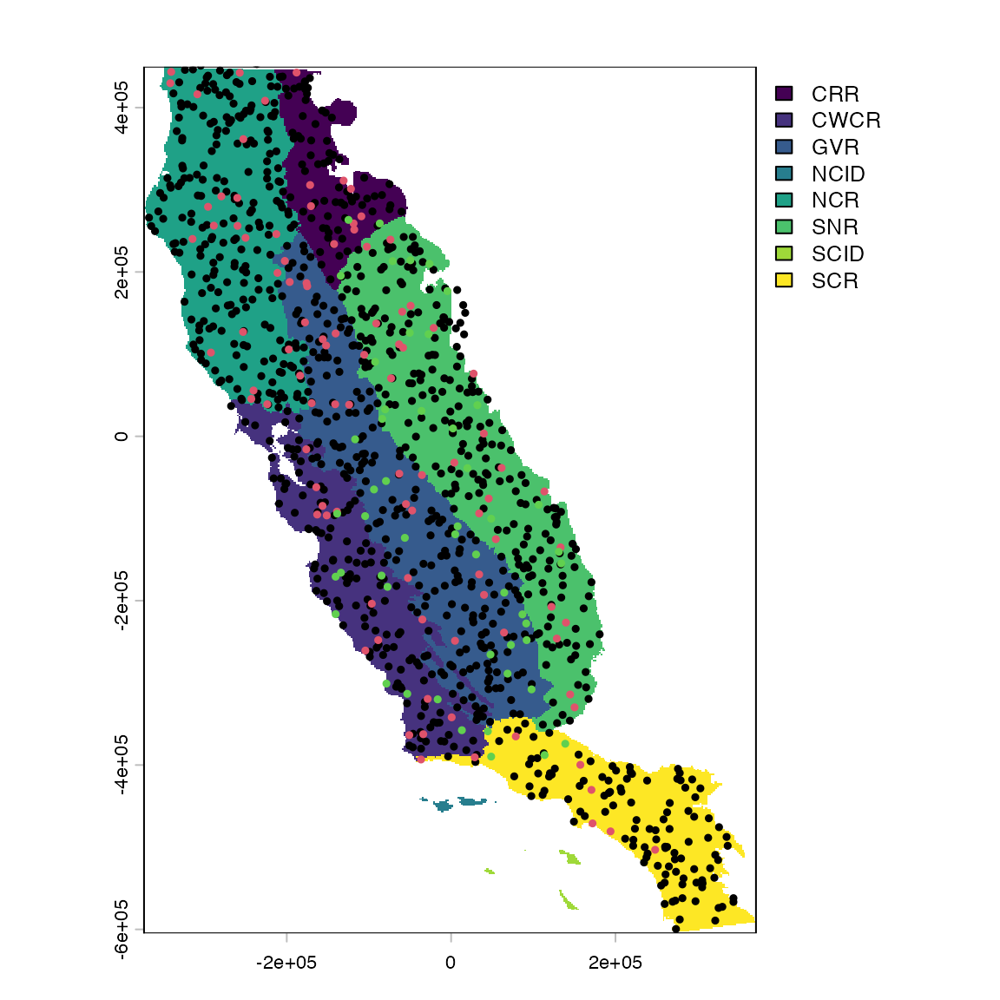

# flexsdm: Overview of Pre-modeling functions

## Introduction

Species distribution modeling (SDM) has become a standard tool in many
research areas, including ecology, conservation biology, biogeography,
paleobiogeography, and epidemiology. SDM is an active area of
theoretical and methodological research. The *flexsdm* package provides
users the ability to manipulate and parameterize models in a variety of
ways that meet their unique research needs.

This flexibility enables users to define their own complete or partial
modeling procedure specific for their modeling situation (e.g., number
of variables, number of records, different algorithms and ensemble
methods, algorithms tuning, etc.).

In this vignette, users will learn about the first set of functions in
the *flexsdm* package that fall under the “pre-modeling” umbrella (see
below for full list).

**pre-modeling functions**

- calib_area() Delimit calibration area for constructing species
  distribution models

- correct_colinvar() Collinearity reduction for predictors

- env_outliers() Integration of outliers detection methods in
  environmental space

- part_random() Data partitioning for training and testing models

- part_sblock() Spatial block cross-validation

- part_sband() Spatial band cross-validation

- part_senv() Environmental cross-validation

- plot_res() Plot different resolutions to be used in part_sblock

- get_block() Transform a spatial partition layer to the same spatial
  properties as the environmental variables

- sample_background() Sample background points

- sample_pseudoabs() Sample pseudo-absence

- sdm_directory() Create directories for saving the outputs of flexsdm

- sdm_extract() Extract environmental data based on x and y coordinates

- occfilt_env() Perform environmental filtering on species occurrences

- occfilt_geo() Perform geographical filtering on species occurrences

## Installation

First, install the flexsdm package. You can install the released version
of *flexsdm* from [github](https://github.com/sjevelazco/flexsdm) with:

``` r
# devtools::install_github('sjevelazco/flexsdm')
library(flexsdm)
library(dplyr)
#> 
#> Attaching package: 'dplyr'
#> The following objects are masked from 'package:stats':
#> 
#>     filter, lag
#> The following objects are masked from 'package:base':
#> 
#>     intersect, setdiff, setequal, union
library(terra)
#> terra 1.8.60
#> 
#> Attaching package: 'terra'
#> The following object is masked from 'package:knitr':
#> 
#>     spin
library(ggplot2)
```

## Project Directory Setup

When building SDM’s, organizing folders (directories) for a project will
save time and confusion. The project directory is the main project
folder where you will store all of the relevant data and results for
your current project. Now, let’s create a project directory where your
initial data and the model results will be stored. The function
sdm_directory() can do this for you, based on the types of model
algorithms you want to use and/or the types of projections you would
like to make. First decide where on your computer you would like to
store the inputs and outputs of the project (this will be the main
directory) and then use dir.create() to create that main directory.
Next, specify whether or not you want to include folders for
projections, calibration areas, algorithms, ensembles, and thresholds.

``` r
my_project <- file.path(file.path(tempdir(), "flex_sdm_project"))
dir.create(my_project)

project_directory <- sdm_directory(
  main_dir = my_project,
  projections = NULL,
  calibration_area = TRUE,
  algorithm = c("fit_max", "tune_raf"),
  ensemble = c("mean"),
  threshold = TRUE,
  return_vector = TRUE
)
```

## Data, species occurrence and background data

In this tutorial, we will be using species occurrences that are
available through the *flexsdm* package. The “spp” example dataset
includes pr_ab column (presence = 1, and absence = 0), and location
columns (x, y). You can load the “spp” data into your local R
environment by using the code below:

``` r
data("spp")

spp
#> # A tibble: 1,150 × 4
#>    species        x        y pr_ab
#>    <chr>      <dbl>    <dbl> <dbl>
#>  1 sp1       -5541. -145138.     0
#>  2 sp1      -51981.   16322.     0
#>  3 sp1     -269871.   69512.     1
#>  4 sp1      -96261.  -32008.     0
#>  5 sp1      269589. -566338.     0
#>  6 sp1       29829. -328468.     0
#>  7 sp1     -152691.  393782.     0
#>  8 sp1     -195081.  253652.     0
#>  9 sp1        -951. -277978.     0
#> 10 sp1      145929. -271498.     0
#> # ℹ 1,140 more rows
```

## Geographic region

Our species occurrences are located in the California Floristic Province
(far western USA). The “regions” dataset can be used to visualize the
study area in geographic space.

``` r
regions <- system.file("external/regions.tif", package = "flexsdm")
regions <- terra::rast(regions)
```

How are the points distributed across our study area?

``` r
try(plot(regions), silent = TRUE)
points(spp[, 2:3], pch = 19, cex = 0.5, col = as.factor(spp$species))
```



## Calibration area

An important decision in SDM is how to delimit your model’s calibration
area, or the geographic space you will use to train your model(s).
Choice of calibration area affects other modeling steps, including
sampling pseudo-absence and background points, performance metrics, and
the geographic patterns of habitat suitability. You would not want to
train an SDM using the entire extent of the United States if you are
interested in the geographic distribution and environmental controls of
a rare plant species that is only found on mountaintops in the Sierra
Nevada, California!

Let’s use presence locations for one species in this exercise.

``` r
spp1 <-
  spp %>%
  dplyr::filter(species == "sp1") %>%
  dplyr::filter(pr_ab == 1) %>%
  dplyr::select(-pr_ab)
```

The calib_area() function offers three methods for defining a
calibration area: buffer, mcp, bmcp, and mask. We will briefly go over
each.

### 1. Buffer

Here the calibration area is defined using buffers around presence
points. User’s can specify the distance around points using the “width”
argument. The buffer width value is interpreted in m if the CRS has a
longitude/latitude, or in map units in other cases.

``` r
crs(regions, proj = TRUE)
#> [1] "+proj=aea +lat_0=0 +lon_0=-120 +lat_1=34 +lat_2=40.5 +x_0=0 +y_0=-4000000 +datum=NAD83 +units=m +no_defs"

ca_1 <- calib_area(
  data = spp1,
  x = "x",
  y = "y",
  method = c("buffer", width = 40000),
  crs = crs(regions)
)
plot(regions, main = "Buffer method")
plot(ca_1, add = TRUE)
points(spp1[, 2:3], pch = 19, cex = 0.5)
```


### 2. Minimum convex polygon

The minimum convex polygon (mcp) method produces a much simpler shape.

``` r
ca_2 <- calib_area(
  data = spp1,
  x = "x",
  y = "y",
  method = c("mcp"),
  crs = crs(regions)
)

plot(regions, main = "Minimum convex polygon method")
plot(ca_2, add = TRUE)
points(spp1[, 2:3], pch = 19, cex = 0.5)
```


### 3. Buffered minimum convex polygon

You can also create a buffer around the minimum convex polygon.

``` r
ca_3 <- calib_area(
  data = spp1,
  x = "x",
  y = "y",
  method = c("bmcp", width = 40000),
  crs = crs(regions)
)

plot(regions, main = "Buffered minimum convex polygon")
plot(ca_3, add = TRUE)
points(spp1[, 2:3], pch = 19, cex = 0.5)
```


### 4. Mask

The mask method allows polygons to be selected that intersect with your
species locations to delineate the calibration area. This is useful if
you expect species distributions to be associated with ecologically
significant (and mapped) ecoregions, or are interested in distributions
within political boundaries. We will use a random set of polygons named
“clusters” to illustrate the mask method. The original polygons are on
the left and the polygons that contain points (our “mask” calibration
area) are on the right.

``` r
clusters <- system.file("external/clusters.shp", package = "flexsdm")
clusters <- terra::vect(clusters)

ca_4 <- calib_area(
  data = spp1,
  x = "x",
  y = "y",
  method = c("mask", clusters, "clusters"),
  crs = crs(regions)
)

par(mfrow = c(1, 2))
plot(clusters, main = "Original polygons")
plot(ca_4, main = "Polygons with points (mask)")
points(spp1[, 2:3], pch = 19, cex = 0.5)
```


## Reducing collinearity among the predictors

Predictor collinearity is a common issue for SDMs, which can lead to
model overfitting and inaccurate tests of significance for predictors
(De Marco & Nóbrega, 2018; Dormann et al., 2013).

### Environmental predictors

Here we will use four climatic variables available in the *flexsdm*
package: actual evapotranspiration (CFP_1), climatic water deficit
(CFP_2), maximum temperature of the warmest month (CFP_3), and minimum
temperature of the coldest month (CFP_4).

``` r
somevar <- system.file("external/somevar.tif", package = "flexsdm")

somevar <- terra::rast(somevar)

names(somevar) <- c("aet", "cwd", "tmx", "tmn")

plot(somevar)
```


The relationship between different environmental variables can be
visualized with the pairs() function from the *terra* package. Several
of our variables are highly correlated (.89 for predictors tmx and tmn).

``` r
terra::pairs(somevar)
```


So how can we correct for or reduce this collinearity? The function
correct_colinvar() has four methods to deal with collinearity: pearson,
vif, pca, and fa. Each method returns 1) a raster object (SpatRaster)
with the selected predictors and 2) other useful outputs relevant to
each method. These functions should be used as supplementary tools, as
predictor selection in SDMs is complicated and ultimately should be
based on the relationship between the environment and species’ biology.
With that being said, these functions offer options for exploring the
relationships between predictor variables that can aid in the predictor
selection process.

All collinearity analysis could be based on entire cells of
environmental rasters or just using those cells with species points used
to construct the models (see `details` and `based_on_points` argument of
`correct_colivar()` function). Use or not `based_on_points` approach
could yield different results.

Let’s look at each method:

### 1. Pearson correlation

This method returns three objects 1) SpatRaster with environmental
variables with a correlation below a given threshold (the default is
0.7), 2) the names of the variables that had a correlation above the
given threshold and were “removed” from the environmental data, and 3) a
correlation matrix of all of the environmental variables. However, we
strongly urge users to use this information along with knowledge about
specific species-environment relationships to select
ecologically-relevant predictors for their SDMs. For example, here, we
are modeling the distribution of a plant species in a water-limited
Mediterranean-type ecosystem, so we may want to include BOTH climatic
water deficit (cwd) and actual evapotranspiration (aet). Despite being
highly correlated, these variables capture water availability and
evaporative demand, respectively (Stephenson 1998). Additionally,
minimum absolute temperature strongly controls vegetation distributions
(Woodward, Lomas, and Kelly 2004), so we would select tmn (minimum
temperature of the coldest month) in this example.

For references, see:

#### 1. Stephenson, N. 1998. Actual evapotranspiration and deficit: biologically meaningful correlates of vegetation distribution across spatial scales. Journal of biogeography 25:855–870.

#### 2. Woodward, F. I., M. R. Lomas, and C. K. Kelly. 2004. Global climate and the distribution of plant biomes. Philosophical transactions of the Royal Society of London. Series B, Biological sciences 359:1465–1476.

``` r
pearson_var <- correct_colinvar(somevar, method = c("pearson", th = "0.7"))
pearson_var$cor_table
#>           aet       cwd       tmx       tmn
#> aet 0.0000000 0.7689893 0.7924813 0.7845401
#> cwd 0.7689893 0.0000000 0.4168956 0.5881831
#> tmx 0.7924813 0.4168956 0.0000000 0.7323259
#> tmn 0.7845401 0.5881831 0.7323259 0.0000000
pearson_var$cor_variables
#> $aet
#> [1] "cwd" "tmx" "tmn"
#> 
#> $cwd
#> [1] "aet"
#> 
#> $tmx
#> [1] "aet" "tmn"
#> 
#> $tmn
#> [1] "aet" "tmx"

chosen_variables <- somevar[[c("cwd", "aet", "tmn")]]
```

### 2. Variance inflation factor

This method removes the predictors with a variance inflation factor
higher than the chosen threshold. Again, users can specify a threshold
(the default is 10). This method retains the predictors aet, tmx, and
tmn and removes cwd. The output for this method matches what is produced
by the pearson method: 1) environmental layer of retained variables, 2)
a list of removed variables, and 3) a correlation matrix of all
variables.

``` r
vif_var <- correct_colinvar(somevar, method = c("vif", th = "10"))
vif_var$env_layer
#> class       : SpatRaster 
#> size        : 558, 394, 4  (nrow, ncol, nlyr)
#> resolution  : 1890, 1890  (x, y)
#> extent      : -373685.8, 370974.2, -604813.3, 449806.7  (xmin, xmax, ymin, ymax)
#> coord. ref. : +proj=aea +lat_0=0 +lon_0=-120 +lat_1=34 +lat_2=40.5 +x_0=0 +y_0=-4000000 +datum=NAD83 +units=m +no_defs 
#> source      : somevar.tif 
#> names       :      aet,      cwd,       tmx,        tmn 
#> min values  :    0.000, -9.39489,  22.44685,  0.2591429 
#> max values  : 1357.865, 14.20047, 614.69125, 64.3747588
vif_var$removed_variables
#> NULL
vif_var$vif_table
#> # A tibble: 4 × 2
#>   Variables   VIF
#>   <chr>     <dbl>
#> 1 aet        7.62
#> 2 cwd        3.29
#> 3 tmx        3.95
#> 4 tmn        2.89
```

### 3. Principal component analysis

Finally, the “pca” method performs a principal components analysis on
the predictors and returns the axis that accounts for 95% of the total
variance in the system. This method returns 1) a SpatRaster object with
selected environmental variables, 2) a matrix with the coefficients of
principal components for predictors, and 3) a tibble with the cumulative
variance explained in selected principal components.

``` r
pca_var <- correct_colinvar(somevar, method = c("pca"))
pca_var$env_layer
#> class       : SpatRaster 
#> size        : 558, 394, 3  (nrow, ncol, nlyr)
#> resolution  : 1890, 1890  (x, y)
#> extent      : -373685.8, 370974.2, -604813.3, 449806.7  (xmin, xmax, ymin, ymax)
#> coord. ref. : +proj=aea +lat_0=0 +lon_0=-120 +lat_1=34 +lat_2=40.5 +x_0=0 +y_0=-4000000 +datum=NAD83 +units=m +no_defs 
#> source(s)   : memory
#> names       :       PC1,       PC2,       PC3 
#> min values  : -8.453273, -4.260147, -1.525085 
#> max values  :  2.827164,  3.337545,  4.342864
pca_var$coefficients
#> # A tibble: 4 × 5
#>   variable    PC1     PC2    PC3     PC4
#>   <chr>     <dbl>   <dbl>  <dbl>   <dbl>
#> 1 aet       0.550 -0.0722  0.296 -0.778 
#> 2 cwd       0.450 -0.777   0.103  0.429 
#> 3 tmx      -0.485 -0.594  -0.450 -0.459 
#> 4 tmn      -0.511 -0.198   0.836 -0.0241
pca_var$cumulative_variance
#> # A tibble: 4 × 2
#>      PC  cvar
#>   <int> <dbl>
#> 1     1 0.764
#> 2     2 0.915
#> 3     3 0.979
#> 4     4 1
```

### 4. Factorial analysis

Selecting the “fa” method performs a factorial analysis to reduce
dimensionality and selects the predictor(s) with the highest correlation
to each axis. The outputs for this method are similar to those produced
by the ‘pca’ method.

``` r
fa_var <- correct_colinvar(env_layer = somevar, method = c("fa"))
fa_var$env_layer
fa_var$number_factors
fa_var$removed_variables
fa_var$uniqueness
fa_var$loadings
```

### 5. Comments

In *flexsdm* it is also possible to restrict the cell used to perform
collinearity reduction analysis to a geographical area smaller than the
full extent of environmental variables. See the ‘restric_to_region’ and
‘restric_pca_proj’ in
[correct_colinvar](https://sjevelazco.github.io/flexsdm/reference/correct_colinvar.html)
and the examples with alternative PCA given in this function help.

## Data filtering

Sample bias in species occurrence data is a common issue in ecological
studies and filtering the occurrence data can reduce some of this bias.
*flexsdm* provides two functions for different types of filtering, based
on geographical or environmental “thinning”, randomly removing points
where they are dense (oversampling) in geographical or environmental
space. This can improve model performance and reduce redundancy in your
data.

### Environmental filtering

The function
[`occfilt_env()`](https://sjevelazco.github.io/flexsdm/reference/occfilt_env.md),
which performs environmental filtering on species occurrence data. This
method basically reduces environmental redundancy in your data and is
based on methods outlined in Valera et al. (2014). However, this
function is unique to *flexsdm*, as it is able to use any number of
environmental dimensions and does not perform a PCA before filtering. In
this example, we will use our original environmental data (somevar) and
occurrence data for a single species (spp1). For filtering occurrences,
it is important that each row in the species data has its own unique
code (example: idd). This function also gives the user the option of
specifying the number classes used to split each environmental
condition. Here we will explore the results using 5, 8, and 12 bins.
Increasing the number of bins increases the number of occurrence points
retained.

``` r
spp1$idd <- 1:nrow(spp1)

filt_env5 <- occfilt_env(
  data = spp1,
  x = "x",
  y = "y",
  id = "idd",
  env_layer = somevar,
  nbins = 5
)
#> Extracting values from raster ...
#> 12 records were removed because they have NAs for some variables
#> Number of unfiltered records: 238
#> Number of filtered records: 57

filt_env8 <- occfilt_env(
  data = spp1,
  x = "x",
  y = "y",
  id = "idd",
  env_layer = somevar,
  nbins = 8
)
#> Extracting values from raster ...
#> 12 records were removed because they have NAs for some variables
#> Number of unfiltered records: 238
#> Number of filtered records: 112

filt_env12 <- occfilt_env(
  data = spp1,
  x = "x",
  y = "y",
  id = "idd",
  env_layer = somevar,
  nbins = 12
)
#> Extracting values from raster ...
#> 12 records were removed because they have NAs for some variables
#> Number of unfiltered records: 238
#> Number of filtered records: 173


par(mfrow = c(2, 2))
somevar[[1]] %>% plot(main = "Original occurrence data")
points(spp1 %>% select(x, y))
somevar[[1]] %>% plot(main = "Filtering with 5 bins")
points(filt_env5 %>% select(x, y))
somevar[[1]] %>% plot(main = "Filtering with 8 bins")
points(filt_env8 %>% select(x, y))
somevar[[1]] %>% plot(main = "Filtering with 12 bins")
points(filt_env12 %>% select(x, y))
```


### Geographical filtering

Next, we will look at
[`occfilt_geo()`](https://sjevelazco.github.io/flexsdm/reference/occfilt_geo.md),
which has three alternatives to determine the distance threshold between
a pair of points: “moran” determines the threshold as the distance
between points that minimizes the spatial autocorrelation in occurrence
data; “cellsize” filters occurrences based on the resolution of the
predictors (or a specified coarser resolution); finally, “determined”
allows users to manually determine the distance threshold.

``` r
filt_geo1 <- occfilt_geo(
  data = spp1,
  x = "x",
  y = "y",
  env_layer = somevar,
  method = c("moran"),
  prj = crs(somevar)
)
#> Extracting values from raster ...
#> 16 records were removed because they have NAs for some variables
#> Number of unfiltered records: 234
#> Moran's I threshold closest to the supplied value: 0.099
#> Distance threshold (km) : 334.908
#> Number of filtered records: 4

filt_geo2 <- occfilt_geo(
  data = spp1,
  x = "x",
  y = "y",
  env_layer = somevar,
  method = c("cellsize", factor = "3"), # coarser resolution than the provided raster
  prj = crs(somevar)
)
#> Extracting values from raster ...
#> 16 records were removed because they have NAs for some variables
#> Number of unfiltered records: 234
#> Factor: x3
#> Distance threshold (km): 4.617
#> Number of filtered records: 212

filt_geo3 <- occfilt_geo(
  data = spp1,
  x = "x",
  y = "y",
  env_layer = somevar,
  method = c("defined", d = "30"),
  prj = crs(somevar)
)
#> Extracting values from raster ...
#> 16 records were removed because they have NAs for some variables
#> Number of unfiltered records: 234
#> Distance threshold (km): 30
#> Number of filtered records: 78

par(mfrow = c(2, 2))
somevar[[1]] %>% plot(main = "Original occurrence data")
points(spp1 %>% select(x, y))
somevar[[1]] %>% plot(main = "Filtering with Moran's I")
points(filt_geo1 %>% select(x, y))
somevar[[1]] %>% plot(main = "Filtering with cell size")
points(filt_geo2 %>% select(x, y))
somevar[[1]] %>% plot(main = "Filtering with defined distance (30km)")
points(filt_geo3 %>% select(x, y))
```


Also, for the three methods, it is possible methods use several values,
turning easier the possibility to explore or test several filtering
values.

``` r
filt_geo1 <- occfilt_geo(
  data = spp1,
  x = "x",
  y = "y",
  env_layer = somevar,
  method = c("moran", c(0.1, 0.2, 0.3, 0.5)),
  prj = crs(somevar)
)

filt_geo2 <- occfilt_geo(
  data = spp1,
  x = "x",
  y = "y",
  env_layer = somevar,
  method = c("cellsize", factor = c(1, 5, 8, 12)), # coarser resolution than the provided raster
  prj = crs(somevar)
)

filt_geo3 <- occfilt_geo(
  data = spp1,
  x = "x",
  y = "y",
  env_layer = somevar,
  method = c("defined", d = c(5, 10, 15, 30)),
  prj = crs(somevar)
)

# When several values are used, note the function returns a list with the filtered data
filt_geo1 %>% class()
#> [1] "list"
filt_geo1 %>% names()
#> [1] "0.1" "0.2" "0.3" "0.5"

# Let's plot the results with ggplot2
bind_rows(filt_geo1, .id = "moran") %>%
  dplyr::mutate(moran = as.numeric(moran)) %>%
  ggplot(aes(x, y)) +
  geom_point() +
  facet_wrap(~moran)
```


``` r


bind_rows(filt_geo2, .id = "cellsize") %>%
  dplyr::mutate(moran = as.numeric(cellsize)) %>%
  ggplot(aes(x, y)) +
  geom_point() +
  facet_wrap(~cellsize)
```


``` r

bind_rows(filt_geo2, .id = "determined") %>%
  dplyr::mutate(moran = as.numeric(determined)) %>%
  ggplot(aes(x, y)) +
  geom_point() +
  facet_wrap(~determined)
```


When tested filtering occurrence with different values, you can use the
[`occfilt_select()`](https://sjevelazco.github.io/flexsdm/reference/occfilt_select.md)
function to select the filtered dataset that equilibrate spatial
autocorrelation maximum number of presences (see
[`occfilt_select()`](https://sjevelazco.github.io/flexsdm/reference/occfilt_select.md)
function help)

``` r
filt_selected <- occfilt_select(
  occ_list = filt_geo2,
  x = "x", y = "y",
  env_layer = somevar, filter_prop = TRUE
)
#> Dataset with filtered value 8 was selected
filt_selected
#> $occ
#> # A tibble: 156 × 4
#>    species        x        y   idd
#>    <chr>      <dbl>    <dbl> <int>
#>  1 sp1     -269871.   69512.     1
#>  2 sp1     -149991.  267962.     2
#>  3 sp1       91659. -156748.     4
#>  4 sp1     -210471.  326282.     5
#>  5 sp1     -140541.  284972.     6
#>  6 sp1     -217491.   65732.     7
#>  7 sp1      -92481.  155642.    12
#>  8 sp1     -367611.  266072.    13
#>  9 sp1     -184551.  425372.    15
#> 10 sp1     -260151.   57632.    18
#> # ℹ 146 more rows
#> 
#> $filter_prop
#>   filt_value mean_autocorr n_records       aet       cwd       tmx       tmn
#> 1          1     0.3219265       233 0.3534014 0.2017850 0.3352363 0.3972832
#> 2          5     0.2923551       189 0.3276294 0.1400721 0.3170405 0.3846783
#> 3        * 8     0.2602486       156 0.3055744 0.1287050 0.2635844 0.3431307
#> 4         12     0.2291901       118 0.2568785 0.1080880 0.2311247 0.3206691
```

## Data partitioning

Data partitioning, or splitting data into testing and training groups,
is a key step in building SDMs. *flexsdm* offers multiple options for
data partitioning, including part_random(), part_sband(), part_sblock(),
and part_senv(). Let’s explore each of these methods.

### 1. Conventional data partitioning methods (part_random)

The part_random() function provides users the ability to divide species
occurrence data based on conventional partition methods including
k-folds, repeated k-folds, leave-one-out cross-validation, and bootstrap
partitioning.

Here, we use the “kfold” method with 10 folds to divide our data. This
results in 10 folds of occurrence data with 25 observations in each
fold.

``` r
spp1$pr_ab <- 1 # Add a column with 1 to denote that this is presences only data
sp_part1 <- part_random(
  data = spp1,
  pr_ab = "pr_ab",
  method = c(method = "kfold", folds = 10)
)

sp_part1$.part %>% table()
#> .
#>  1  2  3  4  5  6  7  8  9 10 
#> 25 25 25 25 25 25 25 25 25 25
```

### 2. Spatial band cross-validation (part_sband)

Both part_sband() and part_sblock() partition data based on their
position in geographic space. Geographically structured data
partitioning methods are especially useful if users want to evaluate
model transferability to different regions or time periods. The function
part_sband tests for different numbers of spatial partitions using
latitudinal or longitudinal bands and selects the best number of bands
for a given presence, presence-absence, or presence-background dataset.
This procedure is based on spatial autocorrelation, environmental
similarity, and the number of presence/absence records in each band
partition. The function’s output includes 1) a tibble with
presence/absence locations and the assigned partition number, 2) a
tibble with information about the best partition, and 3) a SpatRaster
showing the selected grid.

``` r
set.seed(1)
sp_part2 <- part_sband(
  env_layer = somevar,
  data = spp1,
  x = "x",
  y = "y",
  pr_ab = "pr_ab",
  type = "lat", # specify bands across different degrees of longitude 'lon' or latitude 'lat'.
  min_bands = 2, # minimum number of spatial bands to be tested
  max_bands = 20, # maximum number of spatial bands to be tested
  n_part = 2,
  prop = 0.5
)
#> 12 rows were excluded from database because NAs were found
#> The following number of bands will be tested:
#> 2 | 3 | 4 | 5 | 6 | 7 | 8 | 9 | 10 | 11 | 12 | 13 | 14 | 15 | 16 | 17 | 18 | 19 | 20
#> Creating basic raster mask...
#> Searching for the optimal number of bands...
```

``` r
plot(sp_part2$grid, col = gray.colors(20))
points(sp_part2$part[c("x", "y")],
  col = rainbow(8)[sp_part2$part$.part],
  cex = 0.9,
  pch = c(1, 19)[sp_part2$part$pr_ab + 1]
)
```


### 3. Spatial block cross-validation (part_sblock)

The part_sblock() function is very similar to part_sband() but instead
of bands it explores spatial blocks with different raster cells sizes
and returns the one that is best suited for the input dataset. Here, we
can see the data divided into different “blocks” for training and
testing.

``` r
sp_part3 <- part_sblock(
  env_layer = somevar,
  data = spp1,
  x = "x",
  y = "y",
  pr_ab = "pr_ab",
  min_res_mult = 10, # Minimum value used for multiplying raster resolution and define the finest resolution to be tested
  max_res_mult = 500, # Maximum value used for multiplying raster resolution and define the coarsest resolution to be tested
  num_grids = 30, # Number of grid to be tested between min_res_mult X (raster resolution) and max_res_mult X (raster resolution)
  n_part = 2, # Number of partitions
  prop = 0.5 # Proportion of points used for testing autocorrelation between groupds (0-1)
)
#> 12 rows were excluded from database because NAs were found
#> The following grid cell sizes will be tested:
#> 18900 | 50834.48 | 82768.97 | 114703.45 | 146637.93 | 178572.41 | 210506.9 | 242441.38 | 274375.86 | 306310.34 | 338244.83 | 370179.31 | 402113.79 | 434048.28 | 465982.76 | 497917.24 | 529851.72 | 561786.21 | 593720.69 | 625655.17 | 657589.66 | 689524.14 | 721458.62 | 753393.1 | 785327.59 | 817262.07 | 849196.55 | 881131.03 | 913065.52 | 945000
#> Creating basic raster mask...
#> Searching for the optimal grid size...

plot(sp_part3$grid)
points(sp_part3$part[c("x", "y")],
  col = c("blue", "red")[sp_part3$part$.part],
  cex = 0.5,
  pch = 19
)
```


However, we notice that the grid partition produced by part_sblock has a
different resolution than the original environmental variables. If you
want a map layer with the same properties (i.e. resolution, extent, NAs)
as your original environmental variables, apply the get_block() function
to the grid resulting from part_sblock(). This layer can be really
useful for generating pseudo-absence or background sample points, which
we will explore in the next section.

``` r
terra::res(sp_part3$grid)
#> [1] 881131 881131
terra::res(somevar)
#> [1] 1890 1890

grid_env <- get_block(env_layer = somevar, best_grid = sp_part3$grid)

plot(grid_env) # this is a block layer with the same layer
# properties as environmental variables.
points(sp_part3$part[c("x", "y")],
  col = c("blue", "red")[sp_part3$part$.part],
  cex = 0.5,
  pch = 19
)
```


### 4. Environmental and spatial cross-validation (part_senv)

The final partitioning function in *flexsdm* is part_senv(), which
explores different numbers of environmental partitions based on the
K-means clustering algorithm and returns the one best-suited for a
particular dataset, considering spatial autocorrelation, environmental
similarity, and the number of presence and/or absence records in each
partition. The map below shows partitioning based on these environmental
and spatial factors.

``` r
sp_part4 <- part_senv(
  env_layer = somevar,
  data = spp1,
  x = "x",
  y = "y",
  pr_ab = "pr_ab",
  min_n_groups = 2, # Minimum number of groups to be tested
  max_n_groups = 10, # Maximum number of groups to be tested
  prop = 0.5 # Proportion of points used for testing autocorrelation between groups (0-1)
)
#> 12 rows were excluded from database because NAs were found
#> The following grid cell sizes will be tested:
#> 2 | 3 | 4 | 5 | 6 | 7 | 8 | 9 | 10
#> Searching best partition...

plot(regions, col = gray.colors(9))
points(sp_part4$part[c("x", "y")],
  col = hcl.colors(length(unique(sp_part4$part)))[sp_part4$part$.part],
  cex = 1,
  pch = 19
)
```


## Background and pseudo-absence sampling

Presence-only occurrence data are quite common in ecology and
researchers may not have adequate “absence” data for their species of
interest. Sometimes in building species distribution models, we need to
be able to generate background or pseudo-absence points for the modeling
goals. The *flexsdm* package allows users to do this using
sample_background() and sample_pseudoabs().

### 1. Sample background

The function sample_background() allows slection of background sample
points based on different geographic restrictions and sampling methods.
Here, we sample a set of background points based on our earlier spatial
block partitioning using the “random” method. Using lapply() in this
case ensures that we generate background points in each of our spatial
blocks (n = 2). We are also specifying that we want ten times the amount
of background points as our original occurrences and that our
calibration area will be the buffer area around presence points (see
section on “Calibration area”).

``` r
p_data <-
  sp_part3$part # presence data from spatial block partition example

set.seed(10)
bg <- lapply(1:2, function(x) {
  sample_background(
    data = p_data,
    x = "x",
    y = "y",
    n = sum(p_data == x) * 10,
    # number of background points to be sampled
    method = "random",
    rlayer = grid_env,
    maskval = x,
    calibarea = ca_1 # A SpatVector which delimit the calibration area used for a given species
  )
}) %>%
  bind_rows() %>%
  mutate(pr_ab = 0)

par(mfrow = c(2, 1))

plot(grid_env, main = "Presence points")
plot(ca_1, add = TRUE)
points(p_data, cex = .7, pch = 19)

plot(grid_env, main = "Background points")
plot(ca_1, add = TRUE)
points(bg, cex = .1, pch = 19)
```


### 2. Sample pseudo-absences

Similarly, the function sample_pseudoabs allows random pseudo-absence
sampling or based on environmental and/or geographical constraints. For
example, specifying method = “env_const” selects pseudo-absences that
are environmentally constrained to regions with lower suitability values
as predicted by a Bioclim model. Additionally, this function allows
users to specify a calibration area from which to generate
pseudo-absence points. Here, we will use the buffer area around presence
points (ca_1) to show what this might look like. As you can see, we have
generated pseudo-absence points that are in the general vicinity of our
presence points, but are concentrated in areas that have lower
environmental suitability. The specific method chosen for sampling
background and/or pseudo-absence points will vary depending on research
goals.

``` r
set.seed(10)
psa <- lapply(1:2, function(x) {
  sample_pseudoabs(
    data = p_data,
    x = "x",
    y = "y",
    n = sum(p_data == x),
    # number of pseudo-absence points to be sampled
    method = c("env_const", env = somevar),
    rlayer = grid_env,
    maskval = x,
    calibarea = ca_1
  )
}) %>%
  bind_rows() %>%
  mutate(pr_ab = 0)
#> Extents do not match, raster layers used were croped to minimum extent
#> Extents do not match, raster layers used were croped to minimum extent

par(mfrow = c(2, 1))

plot(grid_env, main = "Presence points")
plot(ca_1, add = TRUE)
points(p_data, cex = .7, pch = 19)

plot(grid_env, main = "Pseudo-absence points")
plot(ca_1, add = TRUE)
points(psa, cex = .7, pch = 19)
```


## Extracting environmental values

Finally, before modeling species geographic distributions, we must
extract environmental data at the presences +
absences/pseudo-absences/background point locations. The function
sdm_extract() extracts environmental data values based on x and y
coordinates and returns a tibble with the original data + additional
columns for the extracted environmental variables at those locations.
Let’s do this for our original presence points (spp1) and our background
locations (bg).

``` r
all_points <- bind_rows(spp1 %>% dplyr::select(-idd), bg)

ex_spp <- sdm_extract(
  data = all_points,
  x = "x",
  y = "y",
  env_layer = somevar, # Raster with environmental variables
  variables = NULL, # Vector with the variable names of predictor
  # variables Usage variables. = c("aet", "cwd", "tmin"). If no variable is specified, function will return data for all layers.
  filter_na = TRUE
)

ex_spp
```

\#=========#=========#=========#=========#=========#=========#=========#

**Vignette still under construction and changes**

\#=========#=========#=========#=========#=========#=========#=========#
