# flexsdm: Overview of Post-modeling functions

## Introduction

Species distribution modeling (SDM) has become a standard tool in
multiple research areas, including ecology, conservation biology,
biogeography, paleobiogeography, and epidemiology. SDM is an area of
active theoretical and methodological research The *flexsdm* package
provides users the ability to manipulate and parameterize models in a
variety of ways that meet their unique research needs.

This flexibility enables users to define their own complete or partial
modeling procedure specific for their modeling situations (e.g., number
of variables, number of records, different algorithms and ensemble
methods, algorithms tuning, etc.).

In this vignette, users will learn about the post-modeling set of
functions in the *flexsdm* package. These functions were designed with
the aim of assisting the flexsdm user in predicting, evaluating, and
correcting SDMs.

These are the functions created for model prediction, evaluation and
correction:

**Post-modeling functions**

- sdm_predict() Spatial predictions from individual and ensemble models

- sdm_summarize() Merge model performance tables

- interp() Raster interpolation between SDM predictions to two time
  periods

- extra_eval() Measure model extrapolation

- extra_correct() Constraint suitability values under a given
  extrapolation value

- msdm_priori() Create spatial predictor variables to reduce
  overprediction from species distribution models

- msdm_posteriori() Methods to correct overprediction of species
  distribution models based on occurrences and suitability patterns

## Installation

Install the flexsdm package. You can install the released version of
*flexsdm* from [github](https://github.com/sjevelazco/flexsdm) with:

\
`# devtools::install_github('sjevelazco/flexsdm')`\
[`library`](https://rdrr.io/r/base/library.html)`(`[`flexsdm`](https://sjevelazco.github.io/flexsdm/)`)`\
[`library`](https://rdrr.io/r/base/library.html)`(`[`dplyr`](https://dplyr.tidyverse.org)`)`\
`#> `\
`#> Attaching package: 'dplyr'`\
`#> The following objects are masked from 'package:stats':`\
`#> `\
`#>     filter, lag`\
`#> The following objects are masked from 'package:base':`\
`#> `\
`#>     intersect, setdiff, setequal, union`\
[`library`](https://rdrr.io/r/base/library.html)`(`[`terra`](https://rspatial.org/)`)`\
`#> terra 1.9.46`\
`#> `\
`#> Attaching package: 'terra'`\
`#> The following object is masked from 'package:knitr':`\
`#> `\
`#>     spin`

## Project directory setup

Decide where on your computer you would like to store the inputs and
outputs of your project (this will be your main directory). Use an
existing one or use dir.create() to create your main directory. Then
specify whether or not to include folders for projections, calibration
areas, algorithms, ensembles, and thresholds. For more details see
[Vignette
01_pre_modeling](https://sjevelazco.github.io/flexsdm/articles/v01_pre_modeling.html)

## Species occurrence, presence/absense and environmental data

In this tutorial, we will be using the “spp” example dataset which
includes pr_ab (presence = 1, and absence = 0), location (x, y) data for
3 plant species found in California and a raster with environmental
data. You can load these data into your local R environment by using the
code below:

\
[`data`](https://rdrr.io/r/utils/data.html)`(``"spp"``)`\
`somevar`` ``<-`` `[`system.file`](https://rdrr.io/r/base/system.file.html)`(``"external/somevar.tif"``, package ``=`` ``"flexsdm"``)`\
`somevar`` ``<-`` ``terra``::`[`rast`](https://rspatial.github.io/terra/reference/rast.html)`(``somevar``)`

If you want to replace the spp dataset with your own data, make sure
that contains coordinates, species presence = 1 / absence = 0 and a
raster with environmental data.

First, prepare the occurrences, environmental conditions and partitions

\
`# Select only one species`\
`some_sp`` ``<-`` ``spp`` `[`%>%`](https://magrittr.tidyverse.org/reference/pipe.html)\
`  `[`filter`](https://dplyr.tidyverse.org/reference/filter.html)`(``species`` ``==`` ``"sp3"``)`\
\
`# Extract the environmental condition from the rsater for sp3`\
`some_sp`` ``<-`\
`  `[`sdm_extract`](https://sjevelazco.github.io/flexsdm/reference/sdm_extract.md)`(`\
`    data ``=`` ``some_sp``,`\
`    x ``=`` ``"x"``,`\
`    y ``=`` ``"y"``,`\
`    env_layer ``=`` ``somevar`\
`  ``)`\
`#> 4 rows were excluded from database because NAs were found`\
\
`# Make a partition defining the method, folds and replicates`\
`some_sp`` ``<-`` `[`part_random`](https://sjevelazco.github.io/flexsdm/reference/part_random.md)`(`\
`  data ``=`` ``some_sp``,`\
`  pr_ab ``=`` ``"pr_ab"``,`\
`  method ``=`` `[`c`](https://rdrr.io/r/base/c.html)`(``method ``=`` ``"rep_kfold"``, folds ``=`` ``3``, replicates ``=`` ``5``)`\
`)`

Next, fit different models

\
`# Fit and validate a [generalized linear model](https://sjevelazco.github.io/flexsdm/reference/fit_glm.html)`\
`mglm`` ``<-`` `[`fit_glm`](https://sjevelazco.github.io/flexsdm/reference/fit_glm.md)`(`\
`  data ``=`` ``some_sp``,`\
`  response ``=`` ``"pr_ab"``,`\
`  predictors ``=`` `[`c`](https://rdrr.io/r/base/c.html)`(``"CFP_1"``, ``"CFP_2"``, ``"CFP_3"``, ``"CFP_4"``)``,`\
`  partition ``=`` ``".part"``,`\
`  poly ``=`` ``2`\
`)`\
`#> Formula used for model fitting:`\
`#> pr_ab ~ CFP_1 + CFP_2 + CFP_3 + CFP_4 + I(CFP_1^2) + I(CFP_2^2) + I(CFP_3^2) + I(CFP_4^2)`\
`#> Replica number: 1/5`\
`#> Partition number: 1/3`\
`#> Partition number: 2/3`\
`#> Partition number: 3/3`\
`#> Replica number: 2/5`\
`#> Partition number: 1/3`\
`#> Partition number: 2/3`\
`#> Partition number: 3/3`\
`#> Replica number: 3/5`\
`#> Partition number: 1/3`\
`#> Partition number: 2/3`\
`#> Partition number: 3/3`\
`#> Replica number: 4/5`\
`#> Partition number: 1/3`\
`#> Partition number: 2/3`\
`#> Partition number: 3/3`\
`#> Replica number: 5/5`\
`#> Partition number: 1/3`\
`#> Partition number: 2/3`\
`#> Partition number: 3/3`\
\
`# Fit and validate a [random forest model](https://sjevelazco.github.io/flexsdm/reference/fit_raf.html)`\
`mraf`` ``<-`` `[`fit_raf`](https://sjevelazco.github.io/flexsdm/reference/fit_raf.md)`(`\
`  data ``=`` ``some_sp``,`\
`  response ``=`` ``"pr_ab"``,`\
`  predictors ``=`` `[`c`](https://rdrr.io/r/base/c.html)`(``"CFP_1"``, ``"CFP_2"``, ``"CFP_3"``, ``"CFP_4"``)``,`\
`  partition ``=`` ``".part"``,`\
`)`\
`#> Formula used for model fitting:`\
`#> pr_ab ~ CFP_1 + CFP_2 + CFP_3 + CFP_4`\
`#> Replica number: 1/5`\
`#> Partition number: 1/3`\
`#> Partition number: 2/3`\
`#> Partition number: 3/3`\
`#> Replica number: 2/5`\
`#> Partition number: 1/3`\
`#> Partition number: 2/3`\
`#> Partition number: 3/3`\
`#> Replica number: 3/5`\
`#> Partition number: 1/3`\
`#> Partition number: 2/3`\
`#> Partition number: 3/3`\
`#> Replica number: 4/5`\
`#> Partition number: 1/3`\
`#> Partition number: 2/3`\
`#> Partition number: 3/3`\
`#> Replica number: 5/5`\
`#> Partition number: 1/3`\
`#> Partition number: 2/3`\
`#> Partition number: 3/3`\
\
`# Fit and validate a [general boosted regression model](https://sjevelazco.github.io/flexsdm/reference/fit_gbm.html)`\
`mgbm`` ``<-`` `[`fit_gbm`](https://sjevelazco.github.io/flexsdm/reference/fit_gbm.md)`(`\
`  data ``=`` ``some_sp``,`\
`  response ``=`` ``"pr_ab"``,`\
`  predictors ``=`` `[`c`](https://rdrr.io/r/base/c.html)`(``"CFP_1"``, ``"CFP_2"``, ``"CFP_3"``, ``"CFP_4"``)``,`\
`  partition ``=`` ``".part"`\
`)`\
`#> Formula used for model fitting:`\
`#> pr_ab ~ CFP_1 + CFP_2 + CFP_3 + CFP_4`\
`#> Replica number: 1/5`\
`#> Partition number: 1/3`\
`#> Partition number: 2/3`\
`#> Partition number: 3/3`\
`#> Replica number: 2/5`\
`#> Partition number: 1/3`\
`#> Partition number: 2/3`\
`#> Partition number: 3/3`\
`#> Replica number: 3/5`\
`#> Partition number: 1/3`\
`#> Partition number: 2/3`\
`#> Partition number: 3/3`\
`#> Replica number: 4/5`\
`#> Partition number: 1/3`\
`#> Partition number: 2/3`\
`#> Partition number: 3/3`\
`#> Replica number: 5/5`\
`#> Partition number: 1/3`\
`#> Partition number: 2/3`\
`#> Partition number: 3/3`

### 1. Fit and ensemble the models above

\
`# Fit and ensemble the models. To choose the arguments that best fit your own data, see all options available in [fit_ensemble](https://sjevelazco.github.io/flexsdm/reference/fit_ensemble.html)`\
`mensemble`` ``<-`` `[`fit_ensemble`](https://sjevelazco.github.io/flexsdm/reference/fit_ensemble.md)`(`\
`  models ``=`` `[`list`](https://rdrr.io/r/base/list.html)`(``mglm``, ``mraf``, ``mgbm``)``,`\
`  ens_method ``=`` ``"meansup"``,`\
`  thr ``=`` ``NULL``,`\
`  thr_model ``=`` ``"max_sens_spec"``,`\
`  metric ``=`` ``"TSS"`\
`)`\
`#>   |                                                                              |                                                                      |   0%  |                                                                              |======================================================================| 100%`

You can also fit a model using an Ensembles of Small Models approach. In
this example, we fit without threshold specification and with k-fold
cross-validation.

\
`msmall`` ``<-`` `[`esm_gam`](https://sjevelazco.github.io/flexsdm/reference/esm_gam.md)`(`\
`  data ``=`` ``some_sp``,`\
`  response ``=`` ``"pr_ab"``,`\
`  predictors ``=`` `[`c`](https://rdrr.io/r/base/c.html)`(``"CFP_1"``, ``"CFP_2"``, ``"CFP_3"``, ``"CFP_4"``)``,`\
`  partition ``=`` ``".part"``,`\
`  thr ``=`` ``NULL`\
`)`\
`#>   |                                                                              |                                                                      |   0%  |                                                                              |============                                                          |  17%  |                                                                              |=======================                                               |  33%  |                                                                              |===================================                                   |  50%  |                                                                              |===============================================                       |  67%  |                                                                              |==========================================================            |  83%  |                                                                              |======================================================================| 100%`

Finally, we can predict different kinds of models from the same data
(some_sp).
[sdm_predict](https://sjevelazco.github.io/flexsdm/reference/sdm_predict.html)
can be used for predicting one or more models fitted with fit\_ or
tune\_ functions. The output will be a list of SpatRaster with
continuous and/or binary predictions.

\
`# Predict using a single model, which is an mglm model in this example,`\
`# and a threshold type for binary predictions`\
`ind_p`` ``<-`` `[`sdm_predict`](https://sjevelazco.github.io/flexsdm/reference/sdm_predict.md)`(`\
`  models ``=`` ``mglm``,`\
`  pred ``=`` ``somevar``,`\
`  thr ``=`` ``"max_fpb"``,`\
`  con_thr ``=`` ``FALSE``,`\
`  predict_area ``=`` ``NULL`\
`)`\
`#> Predicting individual models`\
\
`# Inspect the object. It's a SpatRaster with 2 layers: glm, max_fpb`\
`# These are the continuous and binary prediction from the model`\
`ind_p`\
`#> $glm`\
`#> class       : SpatRaster`\
`#> size        : 558, 394, 2  (nrow, ncol, nlyr)`\
`#> resolution  : 1890, 1890  (x, y)`\
`#> extent      : -373685.8, 370974.2, -604813.3, 449806.7  (xmin, xmax, ymin, ymax)`\
`#> coord. ref. : +proj=aea +lat_0=0 +lon_0=-120 +lat_1=34 +lat_2=40.5 +x_0=0 +y_0=-4000000 +datum=NAD83 +units=m +no_defs`\
`#> source(s)   : memory`\
`#> varnames    : somevar`\
`#>               somevar`\
`#> names       : glm, max_fpb`\
`#> min values  :   0,       0`\
`#> max values  :   1,       1`\
\
`# Plot to see this layers`\
`ind_p_rst`` ``<-`` ``terra``::`[`rast`](https://rspatial.github.io/terra/reference/rast.html)`(``ind_p``)`\
[`plot`](https://rspatial.github.io/terra/reference/plot.html)`(``ind_p_rst``)`

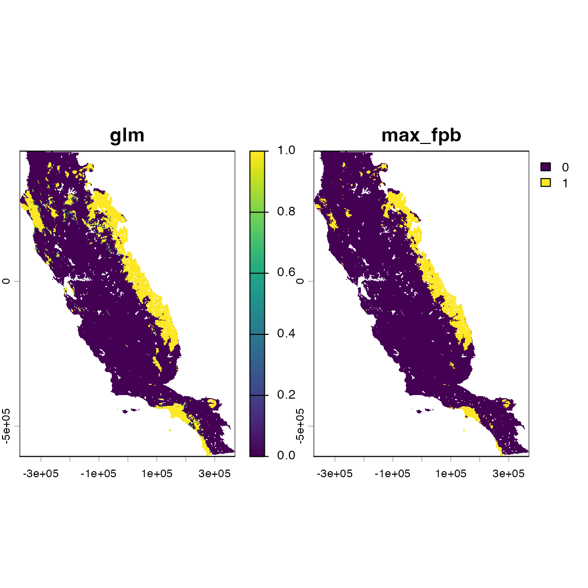

\
\
`# Predict a list of more than one model, specifying a threshold type`\
`list_p`` ``<-`` `[`sdm_predict`](https://sjevelazco.github.io/flexsdm/reference/sdm_predict.md)`(`\
`  models ``=`` `[`list`](https://rdrr.io/r/base/list.html)`(``mglm``, ``mraf``, ``mgbm``)``,`\
`  pred ``=`` ``somevar``,`\
`  thr ``=`` ``"max_fpb"``,`\
`  con_thr ``=`` ``FALSE``,`\
`  predict_area ``=`` ``NULL`\
`)`\
`#> Predicting list of individual models`\
\
`# Inspect the object. It's a list with 3 SpatRaster, one for each model,`\
`# each of which contains 2 layers, for the continuous and thresholded binary predictions.`\
`list_p`\
`#> $glm`\
`#> class       : SpatRaster`\
`#> size        : 558, 394, 2  (nrow, ncol, nlyr)`\
`#> resolution  : 1890, 1890  (x, y)`\
`#> extent      : -373685.8, 370974.2, -604813.3, 449806.7  (xmin, xmax, ymin, ymax)`\
`#> coord. ref. : +proj=aea +lat_0=0 +lon_0=-120 +lat_1=34 +lat_2=40.5 +x_0=0 +y_0=-4000000 +datum=NAD83 +units=m +no_defs`\
`#> source(s)   : memory`\
`#> varnames    : somevar`\
`#>               somevar`\
`#> names       : glm, max_fpb`\
`#> min values  :   0,       0`\
`#> max values  :   1,       1`\
`#> `\
`#> $raf`\
`#> class       : SpatRaster`\
`#> size        : 558, 394, 2  (nrow, ncol, nlyr)`\
`#> resolution  : 1890, 1890  (x, y)`\
`#> extent      : -373685.8, 370974.2, -604813.3, 449806.7  (xmin, xmax, ymin, ymax)`\
`#> coord. ref. : +proj=aea +lat_0=0 +lon_0=-120 +lat_1=34 +lat_2=40.5 +x_0=0 +y_0=-4000000 +datum=NAD83 +units=m +no_defs`\
`#> source(s)   : memory`\
`#> varnames    : somevar`\
`#>               somevar`\
`#> names       : raf, max_fpb`\
`#> min values  :   0,       0`\
`#> max values  :   1,       1`\
`#> `\
`#> $gbm`\
`#> class       : SpatRaster`\
`#> size        : 558, 394, 2  (nrow, ncol, nlyr)`\
`#> resolution  : 1890, 1890  (x, y)`\
`#> extent      : -373685.8, 370974.2, -604813.3, 449806.7  (xmin, xmax, ymin, ymax)`\
`#> coord. ref. : +proj=aea +lat_0=0 +lon_0=-120 +lat_1=34 +lat_2=40.5 +x_0=0 +y_0=-4000000 +datum=NAD83 +units=m +no_defs`\
`#> source(s)   : memory`\
`#> varnames    : somevar`\
`#>               somevar`\
`#> names       :      gbm, max_fpb`\
`#> min values  : 0.000077,       0`\
`#> max values  : 0.953071,       1`\
\
`# Plot to see this layers`\
`list_p_rst`` ``<-`` ``terra``::`[`rast`](https://rspatial.github.io/terra/reference/rast.html)`(``list_p``)`\
[`plot`](https://rspatial.github.io/terra/reference/plot.html)`(``list_p_rst``)`

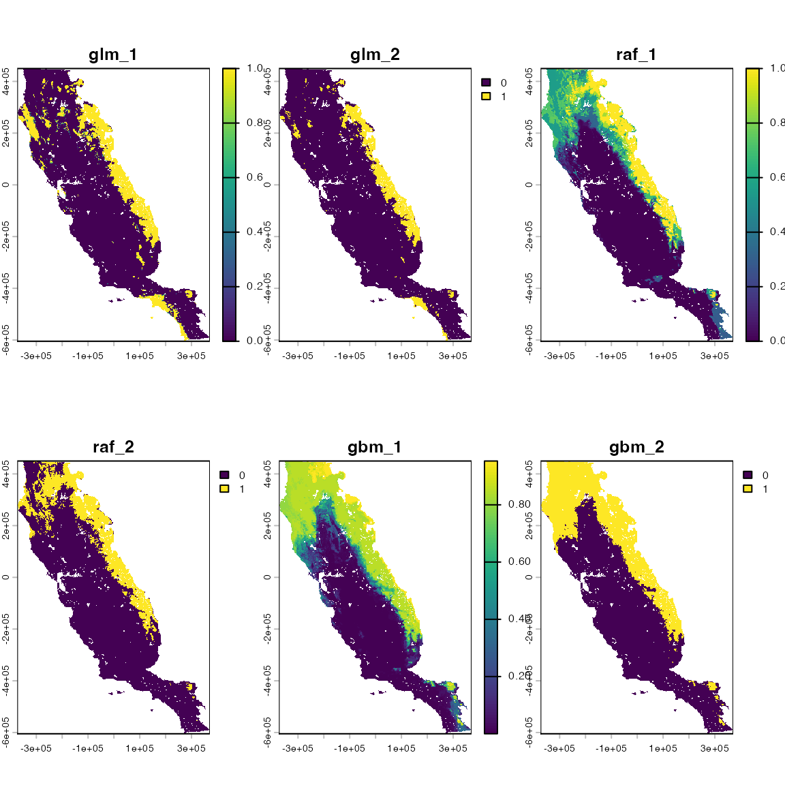

\
\
`# Predict an ensemble model. This is only possible using one fit_ensemble object. It's not possible to include e.g., list(fit_ensemble1, fit_ensemble2) in the model argument.`\
`ensemble_p`` ``<-`` `[`sdm_predict`](https://sjevelazco.github.io/flexsdm/reference/sdm_predict.md)`(`\
`  models ``=`` ``mensemble``,`\
`  pred ``=`` ``somevar``,`\
`  thr ``=`` ``"max_fpb"``,`\
`  con_thr ``=`` ``FALSE``,`\
`  predict_area ``=`` ``NULL`\
`)`\
`#> Predicting ensembles`\
\
`# Inspect the object. It's a SpatRaster with 2 layers, mensemble and max_fpb`\
`# These are the continuous and binary prediction from the ensemble model`\
`ensemble_p`\
`#> $meansup`\
`#> class       : SpatRaster`\
`#> size        : 558, 394, 2  (nrow, ncol, nlyr)`\
`#> resolution  : 1890, 1890  (x, y)`\
`#> extent      : -373685.8, 370974.2, -604813.3, 449806.7  (xmin, xmax, ymin, ymax)`\
`#> coord. ref. : +proj=aea +lat_0=0 +lon_0=-120 +lat_1=34 +lat_2=40.5 +x_0=0 +y_0=-4000000 +datum=NAD83 +units=m +no_defs`\
`#> source(s)   : memory`\
`#> varnames    : somevar`\
`#>               somevar`\
`#> names       : meansup, max_fpb`\
`#> min values  :       0,       0`\
`#> max values  :       1,       1`\
\
`# Plot to see this layers`\
`ensemble_p_rst`` ``<-`` ``terra``::`[`rast`](https://rspatial.github.io/terra/reference/rast.html)`(``ensemble_p``)`\
[`plot`](https://rspatial.github.io/terra/reference/plot.html)`(``ensemble_p_rst``)`

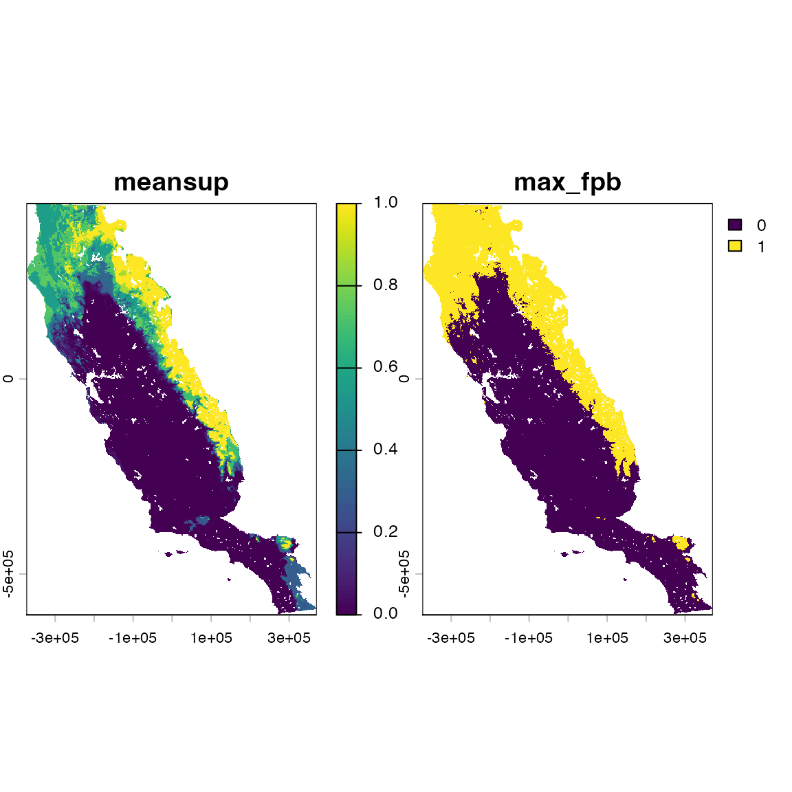

\
\
`# Predict an ensembles of small models.`\
`small_p`` ``<-`` `[`sdm_predict`](https://sjevelazco.github.io/flexsdm/reference/sdm_predict.md)`(`\
`  models ``=`` ``msmall``,`\
`  pred ``=`` ``somevar``,`\
`  thr ``=`` ``"max_fpb"``,`\
`  con_thr ``=`` ``FALSE``,`\
`  predict_area ``=`` ``NULL`\
`)`\
`#> Predicting ensemble of small models`\
\
`# Inspect the object It's a SpatRaster with 2 layers, msmall and max_fpb`\
`# These are the continuous and binary prediction from the ESM model`\
`small_p`\
`#> $esm_gam`\
`#> class       : SpatRaster`\
`#> size        : 558, 394, 2  (nrow, ncol, nlyr)`\
`#> resolution  : 1890, 1890  (x, y)`\
`#> extent      : -373685.8, 370974.2, -604813.3, 449806.7  (xmin, xmax, ymin, ymax)`\
`#> coord. ref. : +proj=aea +lat_0=0 +lon_0=-120 +lat_1=34 +lat_2=40.5 +x_0=0 +y_0=-4000000 +datum=NAD83 +units=m +no_defs`\
`#> source(s)   : memory`\
`#> names       :  esm_gam, max_fpb`\
`#> min values  : 0.000025,       0`\
`#> max values  :        1,       1`\
\
`# Plot to see this layers`\
`small_p_rst`` ``<-`` ``terra``::`[`rast`](https://rspatial.github.io/terra/reference/rast.html)`(``small_p``)`\
[`plot`](https://rspatial.github.io/terra/reference/plot.html)`(``small_p_rst``)`

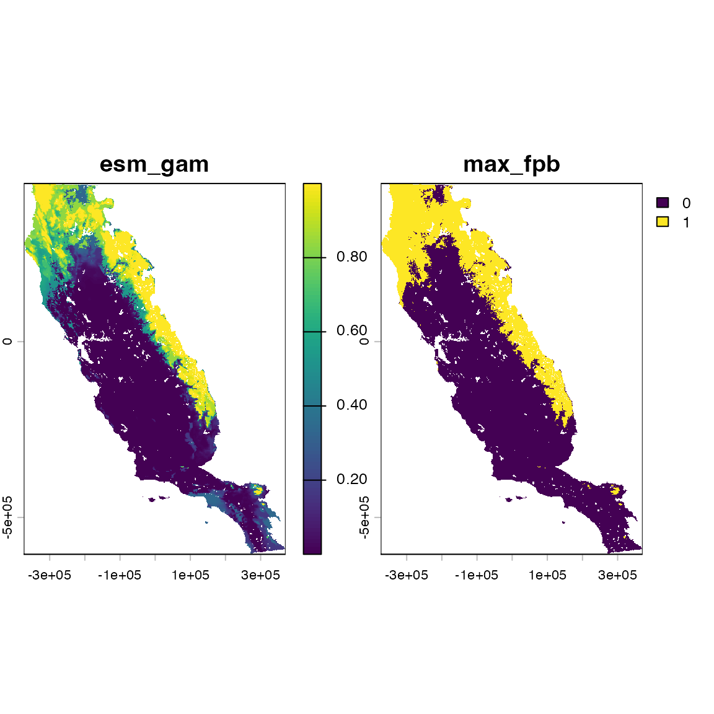

### 2. Merge model performance tables

This function combines model performance tables for all input models.
This function requires a list of one or more models fitted with fit\_ or
tune\_ functions, a fit_ensemble output, or a esm\_ family function
output.

\
`# Load abies data`\
[`data`](https://rdrr.io/r/utils/data.html)`(``abies``)`\
`abies`\
`#> ``# A tibble: 1,400 × 13`\
`#>       id pr_ab        x        y   aet   cwd  tmin ppt_djf ppt_jja    pH    awc`\
`#>    ``<int>`` ``<dbl>``    ``<dbl>``    ``<dbl>`` ``<dbl>`` ``<dbl>`` ``<dbl>``   ``<dbl>``   ``<dbl>`` ``<dbl>``  ``<dbl>`\
`#> `` 1``   715     0  -``95``417.``  ``314``240.  323.  546.  1.24    62.7   17.8   5.77 0.108 `\
`#> `` 2``  ``5``680     0   ``98``987. -``159``415.``  448.  815.  9.43   130.     6.43  5.60 0.160 `\
`#> `` 3``  ``7``907     0  ``121``474.  -``99``463.``  182.  271. -``4.95``   151.    11.2   0    0     `\
`#> `` 4``  ``1``850     0  -``39``976.``  -``17``456.``  372.  946.  8.78   116.     2.70  6.41 0.097``2`\
`#> `` 5``  ``1``702     0  ``111``372.  -``91``404.``  209.  399. -``4.03``   165.     9.27  0    0     `\
`#> `` 6`` ``10``036     0 -``255``715.``  ``392``229.  308.  535.  4.66   166.    16.5   5.70 0.077``7`\
`#> `` 7`` ``12``384     0 -``311``765.``  ``380``213.  568.  352.  4.38   480.    41.2   5.80 0.110 `\
`#> `` 8``  ``6``513     0  ``111``360. -``120``229.``  327.  633.  4.93   163.     8.91  1.18 0.011``6`\
`#> `` 9``  ``9``884     0 -``284``326.``  ``442``136.  377.  446.  3.99   296.    16.8   5.96 0.090``0`\
`#> ``10``  ``8``651     0  ``137``640. -``110``538.``  215.  265. -``4.62``   180.     9.57  0    0     `\
`#> ``# ℹ 1,390 more rows`\
`#> ``# ℹ 2 more variables: depth <dbl>, landform <fct>`\
\
`# Use a subset of the data to keep this tutorial fast to run`\
[`set.seed`](https://rdrr.io/r/base/Random.html)`(``10``)`\
`abies`` ``<-`` ``abies`` `[`%>%`](https://magrittr.tidyverse.org/reference/pipe.html)\
`  ``dplyr``::`[`group_by`](https://dplyr.tidyverse.org/reference/group_by.html)`(``pr_ab``)`` `[`%>%`](https://magrittr.tidyverse.org/reference/pipe.html)\
`  ``dplyr``::`[`slice_sample`](https://dplyr.tidyverse.org/reference/slice.html)`(``prop ``=`` ``0.3``)`` `[`%>%`](https://magrittr.tidyverse.org/reference/pipe.html)\
`  ``dplyr``::`[`ungroup`](https://dplyr.tidyverse.org/reference/group_by.html)`(``)`\
\
`# We will partition the data with the k-fold method`\
`abies2`` ``<-`` `[`part_random`](https://sjevelazco.github.io/flexsdm/reference/part_random.md)`(`\
`  data ``=`` ``abies``,`\
`  pr_ab ``=`` ``"pr_ab"``,`\
`  method ``=`` `[`c`](https://rdrr.io/r/base/c.html)`(``method ``=`` ``"kfold"``, folds ``=`` ``3``)`\
`)`

Build some models to use for the performance table merge

\
`# Build a generalized additive model, and a generalized linear model using fit_ family functions`\
`gam_t1`` ``<-`` `[`fit_gam`](https://sjevelazco.github.io/flexsdm/reference/fit_gam.md)`(`\
`  data ``=`` ``abies2``,`\
`  response ``=`` ``"pr_ab"``,`\
`  predictors ``=`` `[`c`](https://rdrr.io/r/base/c.html)`(``"aet"``, ``"ppt_jja"``, ``"pH"``, ``"awc"``, ``"depth"``)``,`\
`  predictors_f ``=`` `[`c`](https://rdrr.io/r/base/c.html)`(``"landform"``)``,`\
`  partition ``=`` ``".part"``,`\
`  thr ``=`` `[`c`](https://rdrr.io/r/base/c.html)`(``"max_sens_spec"``, ``"equal_sens_spec"``, ``"max_sorensen"``)`\
`)`\
`#> Formula used for model fitting:`\
`#> pr_ab ~ s(aet, k = -1) + s(ppt_jja, k = -1) + s(pH, k = -1) + s(awc, k = -1) + s(depth, k = -1) + landform`\
`#> Replica number: 1/1`\
`#> Partition number: 1/3`\
`#> Partition number: 2/3`\
`#> Partition number: 3/3`\
\
\
`glm_t1`` ``<-`` `[`fit_glm`](https://sjevelazco.github.io/flexsdm/reference/fit_glm.md)`(`\
`  data ``=`` ``abies2``,`\
`  response ``=`` ``"pr_ab"``,`\
`  predictors ``=`` `[`c`](https://rdrr.io/r/base/c.html)`(``"aet"``, ``"ppt_jja"``, ``"pH"``, ``"awc"``, ``"depth"``)``,`\
`  predictors_f ``=`` `[`c`](https://rdrr.io/r/base/c.html)`(``"landform"``)``,`\
`  partition ``=`` ``".part"``,`\
`  thr ``=`` `[`c`](https://rdrr.io/r/base/c.html)`(``"max_sens_spec"``, ``"equal_sens_spec"``, ``"max_sorensen"``)``,`\
`  poly ``=`` ``0``,`\
`  inter_order ``=`` ``0`\
`)`\
`#> Formula used for model fitting:`\
`#> pr_ab ~ aet + ppt_jja + pH + awc + depth + landform`\
`#> Replica number: 1/1`\
`#> Partition number: 1/3`\
`#> Partition number: 2/3`\
`#> Partition number: 3/3`\
\
`# Build a tuned model using tune_ family functions`\
\
`# Prepare the grid object to use in grid argument`\
`tune_grid`` ``<-`\
`  `[`expand.grid`](https://rdrr.io/r/base/expand.grid.html)`(`\
`    mtry ``=`` `[`c`](https://rdrr.io/r/base/c.html)`(``2``, ``4``, ``6``)``,`\
`    ntree ``=`` `[`c`](https://rdrr.io/r/base/c.html)`(``500``, ``1000``)`\
`  ``)`\
\
`# Build a tuned random forest model`\
`rf_t1`` ``<-`\
`  `[`tune_raf`](https://sjevelazco.github.io/flexsdm/reference/tune_raf.md)`(`\
`    data ``=`` ``abies2``,`\
`    response ``=`` ``"pr_ab"``,`\
`    predictors ``=`` `[`c`](https://rdrr.io/r/base/c.html)`(`\
`      ``"aet"``,`\
`      ``"cwd"``,`\
`      ``"tmin"``,`\
`      ``"ppt_djf"``,`\
`      ``"ppt_jja"``,`\
`      ``"pH"``,`\
`      ``"awc"``,`\
`      ``"depth"`\
`    ``)``,`\
`    predictors_f ``=`` `[`c`](https://rdrr.io/r/base/c.html)`(``"landform"``)``,`\
`    partition ``=`` ``".part"``,`\
`    grid ``=`` ``tune_grid``,`\
`    thr ``=`` `[`c`](https://rdrr.io/r/base/c.html)`(``"max_sens_spec"``, ``"equal_sens_spec"``, ``"max_sorensen"``)``,`\
`    metric ``=`` ``"TSS"``,`\
`  ``)`\
`#> Formula used for model fitting:`\
`#> pr_ab ~ aet + cwd + tmin + ppt_djf + ppt_jja + pH + awc + depth + landform`\
`#> Tuning model...`\
`#> Replica number: 1/1`\
`#> Formula used for model fitting:`\
`#> pr_ab ~ aet + cwd + tmin + ppt_djf + ppt_jja + pH + awc + depth + landform`\
`#> Replica number: 1/1`\
`#> Partition number: 1/3`\
`#> Partition number: 2/3`\
`#> Partition number: 3/3`\
\
`rf_t1``$``performance`\
`#> ``# A tibble: 1 × 35`\
`#>    mtry ntree model threshold   thr_value n_presences n_absences TPR_mean TPR_sd`\
`#>   ``<dbl>`` ``<dbl>`` ``<chr>`` ``<chr>``           ``<dbl>``       ``<int>``      ``<int>``    ``<dbl>``  ``<dbl>`\
`#> ``1``     2   500 raf   max_sens_s…     0.592         210        210    0.857 0.051``5`\
`#> ``# ℹ 26 more variables: TNR_mean <dbl>, TNR_sd <dbl>, W_TPR_TNR_mean <dbl>,`\
`#> ``#   W_TPR_TNR_sd <dbl>, SORENSEN_mean <dbl>, SORENSEN_sd <dbl>,`\
`#> ``#   JACCARD_mean <dbl>, JACCARD_sd <dbl>, FPB_mean <dbl>, FPB_sd <dbl>,`\
`#> ``#   OR_mean <dbl>, OR_sd <dbl>, TSS_mean <dbl>, TSS_sd <dbl>, KAPPA_mean <dbl>,`\
`#> ``#   KAPPA_sd <dbl>, MCC_mean <dbl>, MCC_sd <dbl>, AUC_mean <dbl>, AUC_sd <dbl>,`\
`#> ``#   BOYCE_mean <dbl>, BOYCE_sd <dbl>, CRPS_mean <dbl>, CRPS_sd <dbl>,`\
`#> ``#   IMAE_mean <dbl>, IMAE_sd <dbl>`\
`# Note in rf_t1$performance the best model was the one with mtry = 3 and threshold = 'max_sens_spec'`

Finally, merge the three sdm performance tables.

\
`merge_df`` ``<-`` `[`sdm_summarize`](https://sjevelazco.github.io/flexsdm/reference/sdm_summarize.md)`(``models ``=`` `[`list`](https://rdrr.io/r/base/list.html)`(``gam_t1``, ``glm_t1``, ``rf_t1``)``)`\
\
`merge_df`\
`#> ``# A tibble: 7 × 36`\
`#>   model_ID model threshold     thr_value n_presences n_absences TPR_mean  TPR_sd`\
`#>      ``<int>`` ``<chr>`` ``<chr>``             ``<dbl>``       ``<int>``      ``<int>``    ``<dbl>``   ``<dbl>`\
`#> ``1``        1 gam   equal_sens_s…     0.518         210        210    0.702 0.003``40`\
`#> ``2``        1 gam   max_sens_spec     0.601         210        210    0.682 0.105  `\
`#> ``3``        1 gam   max_sorensen      0.351         210        210    0.836 0.046``3`` `\
`#> ``4``        2 glm   equal_sens_s…     0.519         210        210    0.630 0.048``7`` `\
`#> ``5``        2 glm   max_sens_spec     0.485         210        210    0.633 0.216  `\
`#> ``6``        2 glm   max_sorensen      0.299         210        210    0.908 0.031``1`` `\
`#> ``7``        3 raf   max_sens_spec     0.592         210        210    0.857 0.051``5`` `\
`#> ``# ℹ 28 more variables: TNR_mean <dbl>, TNR_sd <dbl>, W_TPR_TNR_mean <dbl>,`\
`#> ``#   W_TPR_TNR_sd <dbl>, SORENSEN_mean <dbl>, SORENSEN_sd <dbl>,`\
`#> ``#   JACCARD_mean <dbl>, JACCARD_sd <dbl>, FPB_mean <dbl>, FPB_sd <dbl>,`\
`#> ``#   OR_mean <dbl>, OR_sd <dbl>, TSS_mean <dbl>, TSS_sd <dbl>, KAPPA_mean <dbl>,`\
`#> ``#   KAPPA_sd <dbl>, MCC_mean <dbl>, MCC_sd <dbl>, AUC_mean <dbl>, AUC_sd <dbl>,`\
`#> ``#   BOYCE_mean <dbl>, BOYCE_sd <dbl>, CRPS_mean <dbl>, CRPS_sd <dbl>,`\
`#> ``#   IMAE_mean <dbl>, IMAE_sd <dbl>, mtry <dbl>, ntree <dbl>`

### 3. Raster interpolation between two time periods

This function is useful for calculating projected suitability values
between two time periods with simple interpolation using two raster
objects with suitability values. This is useful if, for example, a SDM
has been projected to a future or past time period (using maps of
predictor variables, such as climate variables, for different time
periods), and the user requires an estimate of suitability for
intermediate time periods. For example this may be needed for input into
other types of models for risk analysis.

This function returns a SpatRaster if dir_save is used as NULL. However,
if the user specifies dir_save, the function will save the interpolated
raster files in a given directory.

\
[`library`](https://rdrr.io/r/base/library.html)`(`[`terra`](https://rspatial.org/)`)`\
[`library`](https://rdrr.io/r/base/library.html)`(`[`dplyr`](https://dplyr.tidyverse.org)`)`\
\
`f`` ``<-`` `[`system.file`](https://rdrr.io/r/base/system.file.html)`(``"external/suit_time_step.tif"``, package ``=`` ``"flexsdm"``)`\
`abma`` ``<-`` ``terra``::`[`rast`](https://rspatial.github.io/terra/reference/rast.html)`(``f``)`\
[`plot`](https://rspatial.github.io/terra/reference/plot.html)`(``abma``)`

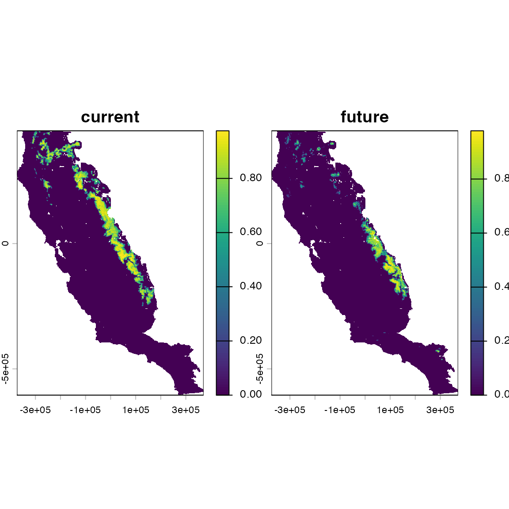

This function will create an object of interpolated values with n annual
layers ranging from the initial to final year. The resolution and
dimensions of the result object will remain the same as the initial and
final maps. In this example, there are nine annual (2011-2019)
interpolated maps generated from the initial (2010) and final (2020)
prediction maps. A cell with a starting value of 1 and and ending value
of 0 would be changed in increments of (1-0)/((2020-2010)-1), and given
interpolated values of 0.9, 0.8, 0.7…0.1

\
`int`` ``<-`` `[`interp`](https://sjevelazco.github.io/flexsdm/reference/interp.md)`(`\
`  r1 ``=`` ``abma``[[``1``]``]``, ``# set the raster of initial year`\
`  r2 ``=`` ``abma``[[``2``]``]``, ``# set the raster of final year`\
`  y1 ``=`` ``2010``, ``# set the numeric initial year`\
`  y2 ``=`` ``2020``, ``# set the numeric final year`\
`  rastername ``=`` ``"Abies"``,`\
`  dir_save ``=`` ``NULL`\
`)`\
\
`# Layers in the abma SpatRaster`\
[`names`](https://rspatial.github.io/terra/reference/names.html)`(``abma``)`\
`#> [1] "current" "future"`\
`# plot(abma)`\
\
`# Layers in the int SpatRaster`\
`int`\
`#> class       : SpatRaster`\
`#> size        : 558, 394, 11  (nrow, ncol, nlyr)`\
`#> resolution  : 1890, 1890  (x, y)`\
`#> extent      : -373685.8, 370974.2, -604813.3, 449806.7  (xmin, xmax, ymin, ymax)`\
`#> coord. ref. : +proj=aea +lat_0=0 +lon_0=-120 +lat_1=34 +lat_2=40.5 +x_0=0 +y_0=-4000000 +datum=NAD83 +units=m +no_defs`\
`#> source(s)   : memory`\
`#> varnames    : suit_time_step`\
`#>               suit_time_step`\
`#>               suit_time_step`\
`#>               suit_time_step`\
`#>               suit_time_step`\
`#>               ...`\
`#> names       : Abies_2010, Abies_2011, Abies_2012, Abies_2013, Abies_2014, Abies_2015, ...`\
`#> min values  :          0,          0,          0,          0,          0,          0, ...`\
`#> max values  :   0.975611,   0.960608,   0.950461,   0.944007,   0.944294,   0.946355, ...`\
[`plot`](https://rspatial.github.io/terra/reference/plot.html)`(``int``)`

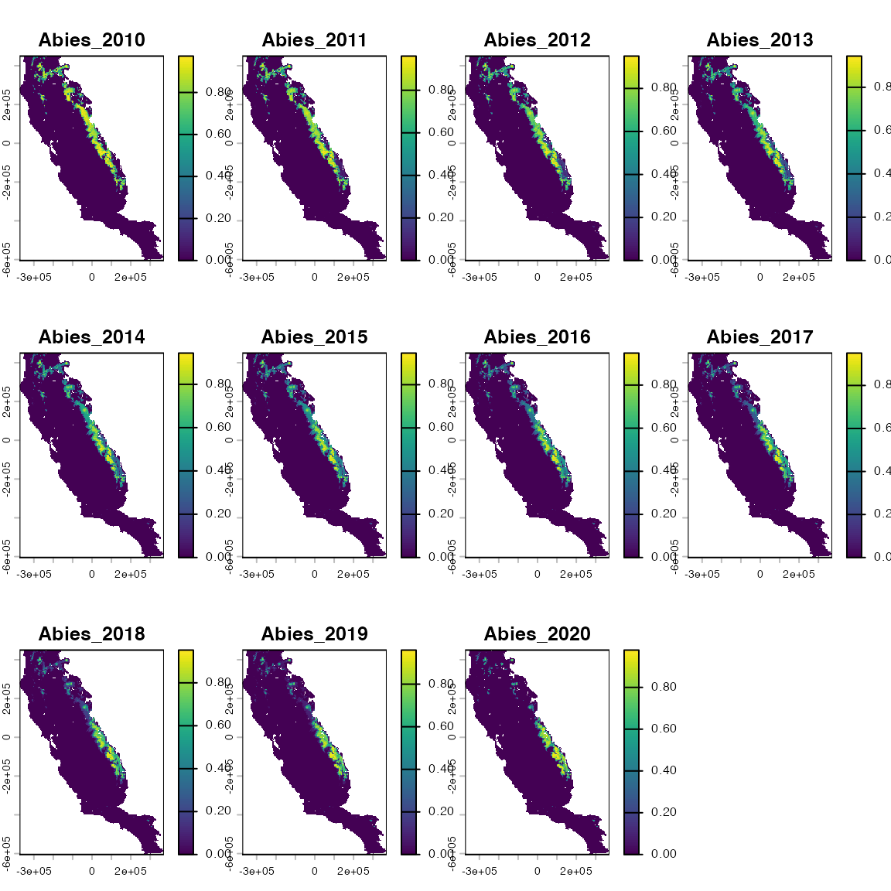

### 4. Measure model extrapolation

This function measures the extent of model extrapolation by comparing
data used for modeling calibration and the area for model projection
using the approach proposed by Velazco et al., in prep.

\
[`library`](https://rdrr.io/r/base/library.html)`(`[`dplyr`](https://dplyr.tidyverse.org)`)`\
[`library`](https://rdrr.io/r/base/library.html)`(`[`terra`](https://rspatial.org/)`)`\
\
[`data`](https://rdrr.io/r/utils/data.html)`(``spp``)`\
`f`` ``<-`` `[`system.file`](https://rdrr.io/r/base/system.file.html)`(``"external/somevar.tif"``, package ``=`` ``"flexsdm"``)`\
`somevar`` ``<-`` ``terra``::`[`rast`](https://rspatial.github.io/terra/reference/rast.html)`(``f``)`\
\
`# Inspect the unique values for species`\
`spp``$``species`` `[`%>%`](https://magrittr.tidyverse.org/reference/pipe.html)` `[`unique`](https://rspatial.github.io/terra/reference/unique.html)`(``)`\
`#> [1] "sp1" "sp2" "sp3"`\
\
`# Subset spp data into a tibble only with coordinates for sp3 and pr_ab == 1`\
`sp`` ``<-`` ``spp`` `[`%>%`](https://magrittr.tidyverse.org/reference/pipe.html)\
`  ``dplyr``::`[`filter`](https://dplyr.tidyverse.org/reference/filter.html)`(``species`` ``==`` ``"sp3"``, ``pr_ab`` ``==`` ``1``)`` `[`%>%`](https://magrittr.tidyverse.org/reference/pipe.html)\
`  ``dplyr``::`[`select`](https://dplyr.tidyverse.org/reference/select.html)`(``x``, ``y``)`\
\
`# Define accessible area for sp3 based on a buffer with around each point that is related to dispersal ability or some other ecological criterion`\
`ca`` ``<-`\
`  `[`calib_area`](https://sjevelazco.github.io/flexsdm/reference/calib_area.md)`(`\
`    ``sp``,`\
`    x ``=`` ``"x"``,`\
`    y ``=`` ``"y"``,`\
`    method ``=`` `[`c`](https://rdrr.io/r/base/c.html)`(``"buffer"``, width ``=`` ``30000``)``,`\
`    crs ``=`` `[`crs`](https://rspatial.github.io/terra/reference/crs.html)`(``somevar``)`\
`  ``)`\
\
`# Plot the SpatRaster, occurrences and accessible area`\
[`plot`](https://rspatial.github.io/terra/reference/plot.html)`(``somevar``$``CFP_1``)`\
[`points`](https://rspatial.github.io/terra/reference/lines.html)`(``sp``)`\
[`plot`](https://rspatial.github.io/terra/reference/plot.html)`(``ca``, add ``=`` ``T``)`

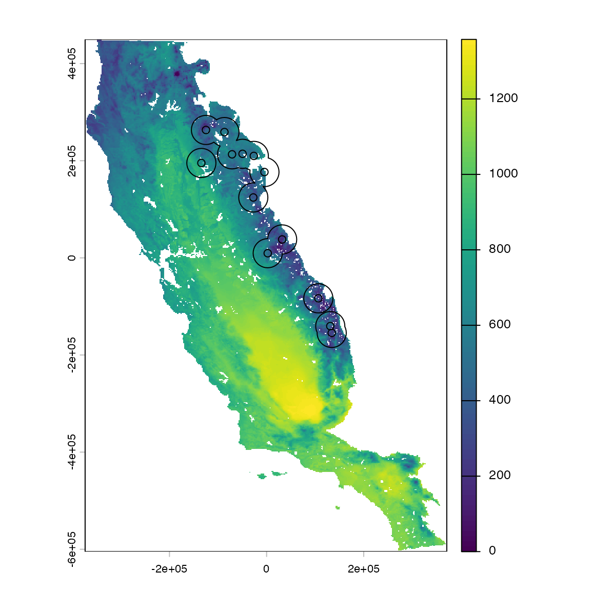

The accessible area defines calibration area used to extract the
environmental conditions

\
`somevar_ca`` ``<-`` ``somevar`` `[`%>%`](https://magrittr.tidyverse.org/reference/pipe.html)\
`  `[`crop`](https://rspatial.github.io/terra/reference/crop.html)`(``.``, ``ca``)`` `[`%>%`](https://magrittr.tidyverse.org/reference/pipe.html)\
`  `[`mask`](https://rspatial.github.io/terra/reference/mask.html)`(``.``, ``ca``)`\
\
`# Plot environmental conditions of the calibration area`\
[`plot`](https://rspatial.github.io/terra/reference/plot.html)`(``somevar_ca``)`

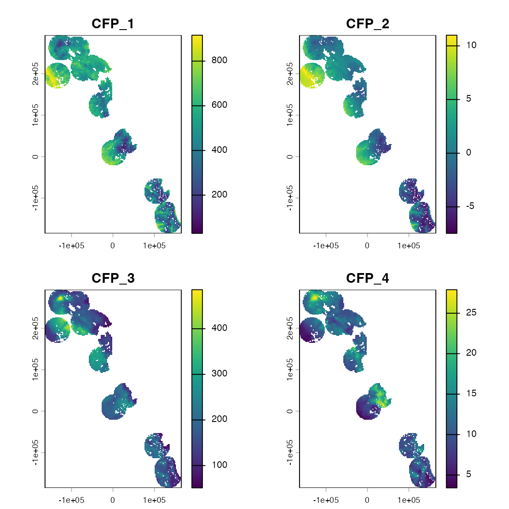

\
\
`xp`` ``<-`\
`  `[`extra_eval`](https://sjevelazco.github.io/flexsdm/reference/extra_eval.md)`(`\
`    training_data ``=`` ``somevar_ca``,`\
`    projection_data ``=`` ``somevar``,`\
`    aggreg_factor ``=`` ``3`\
`  ``)`\
\
`# Plot the SpatRaster object with the extrapolation values measured in percentage`\
[`plot`](https://rspatial.github.io/terra/reference/plot.html)`(``xp``)`

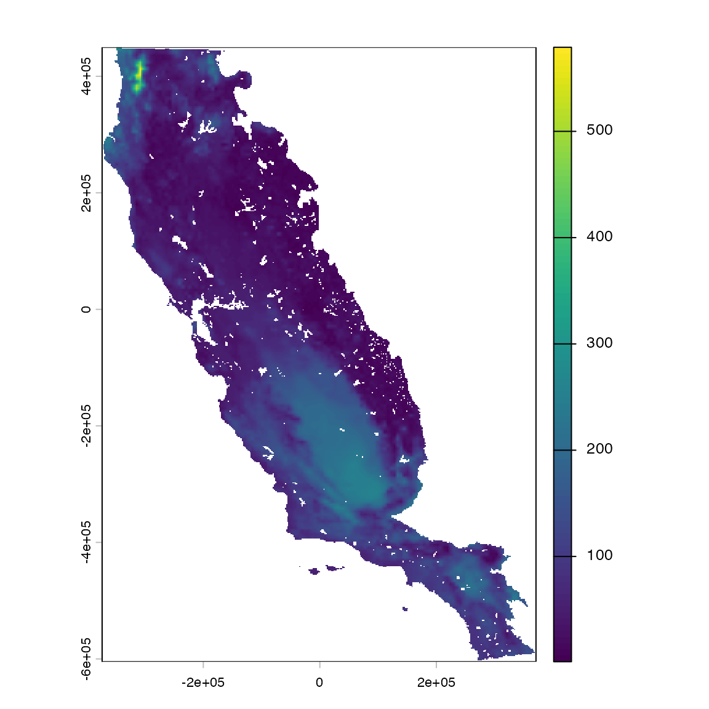

### 5. Correction of suitability based on extrapolation

### 6. Create spatial predictor variables to reduce overprediction of species distribution models

This function creates geographical predictor variables that, together
with environmental variables, can be used to construct constrained
species distribution models. This function returns a SpatRaster object,
which have to be used together with environmental variables to construct
species distribution models. The ‘xy’ approach creates a single pair of
raster layers that can be used for all species that share the same study
region. Otherwise, ‘cml’, ‘min’, and ‘ker’ create a species-specific
raster layer.

\
[`library`](https://rdrr.io/r/base/library.html)`(`[`dplyr`](https://dplyr.tidyverse.org)`)`\
[`library`](https://rdrr.io/r/base/library.html)`(`[`terra`](https://rspatial.org/)`)`\
\
[`data`](https://rdrr.io/r/utils/data.html)`(``"spp"``)`\
`somevar`` ``<-`` `[`system.file`](https://rdrr.io/r/base/system.file.html)`(``"external/somevar.tif"``, package ``=`` ``"flexsdm"``)`\
`somevar`` ``<-`` ``terra``::`[`rast`](https://rspatial.github.io/terra/reference/rast.html)`(``somevar``)`\
\
`# Select the presences of one species (sp3)`\
`occ`` ``<-`` ``spp`` `[`%>%`](https://magrittr.tidyverse.org/reference/pipe.html)\
`  ``dplyr``::`[`filter`](https://dplyr.tidyverse.org/reference/filter.html)`(``species`` ``==`` ``"sp3"``, ``pr_ab`` ``==`` ``1``)`\
\
`# Select a raster layer to be used as a basic raster`\
`a_variable`` ``<-`` ``somevar``[[``1``]``]`\
[`plot`](https://rspatial.github.io/terra/reference/plot.html)`(``a_variable``)`\
[`points`](https://rspatial.github.io/terra/reference/lines.html)`(``occ`` `[`%>%`](https://magrittr.tidyverse.org/reference/pipe.html)` ``dplyr``::`[`select`](https://dplyr.tidyverse.org/reference/select.html)`(``x``, ``y``)``)`

Next, use different methods according to your data.

\
`# Use xy method`\
`m_xy`` ``<-`` `[`msdm_priori`](https://sjevelazco.github.io/flexsdm/reference/msdm_priori.md)`(`\
`  data ``=`` ``occ``,`\
`  x ``=`` ``"x"``,`\
`  y ``=`` ``"y"``,`\
`  method ``=`` ``"xy"``,`\
`  env_layer ``=`` ``a_variable`\
`)`\
\
[`plot`](https://rspatial.github.io/terra/reference/plot.html)`(``m_xy``)`

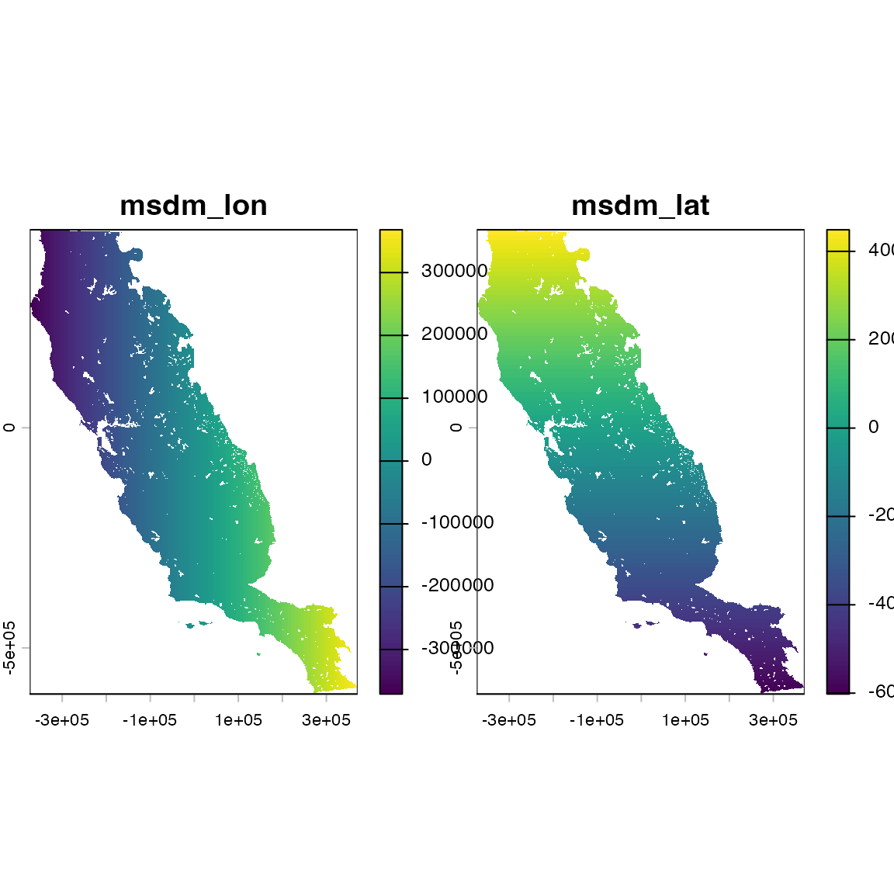

\
\
`# Explore the object. This method assumes that spatial structure can partially explain species distribution (Bahn & Mcgill, 2007). Therefore, the result are two raster layers containing the latitude and longitude of pixels, respectively. This method could be used for all species set that share the same study area region.`\
`m_xy`\
`#> class       : SpatRaster`\
`#> size        : 558, 394, 2  (nrow, ncol, nlyr)`\
`#> resolution  : 1890, 1890  (x, y)`\
`#> extent      : -373685.8, 370974.2, -604813.3, 449806.7  (xmin, xmax, ymin, ymax)`\
`#> coord. ref. : +proj=aea +lat_0=0 +lon_0=-120 +lat_1=34 +lat_2=40.5 +x_0=0 +y_0=-4000000 +datum=NAD83 +units=m +no_defs`\
`#> source(s)   : memory`\
`#> varname     : somevar`\
`#> names       :       msdm_lon,       msdm_lat`\
`#> min values  : -370850.836354, -601978.334189`\
`#> max values  :  368139.163646,  448861.665811`

\
`m_cml`` ``<-`` `[`msdm_priori`](https://sjevelazco.github.io/flexsdm/reference/msdm_priori.md)`(`\
`  data ``=`` ``occ``,`\
`  x ``=`` ``"x"``,`\
`  y ``=`` ``"y"``,`\
`  method ``=`` ``"cml"``,`\
`  env_layer ``=`` ``a_variable`\
`)`\
\
[`plot`](https://rspatial.github.io/terra/reference/plot.html)`(``m_cml``)`

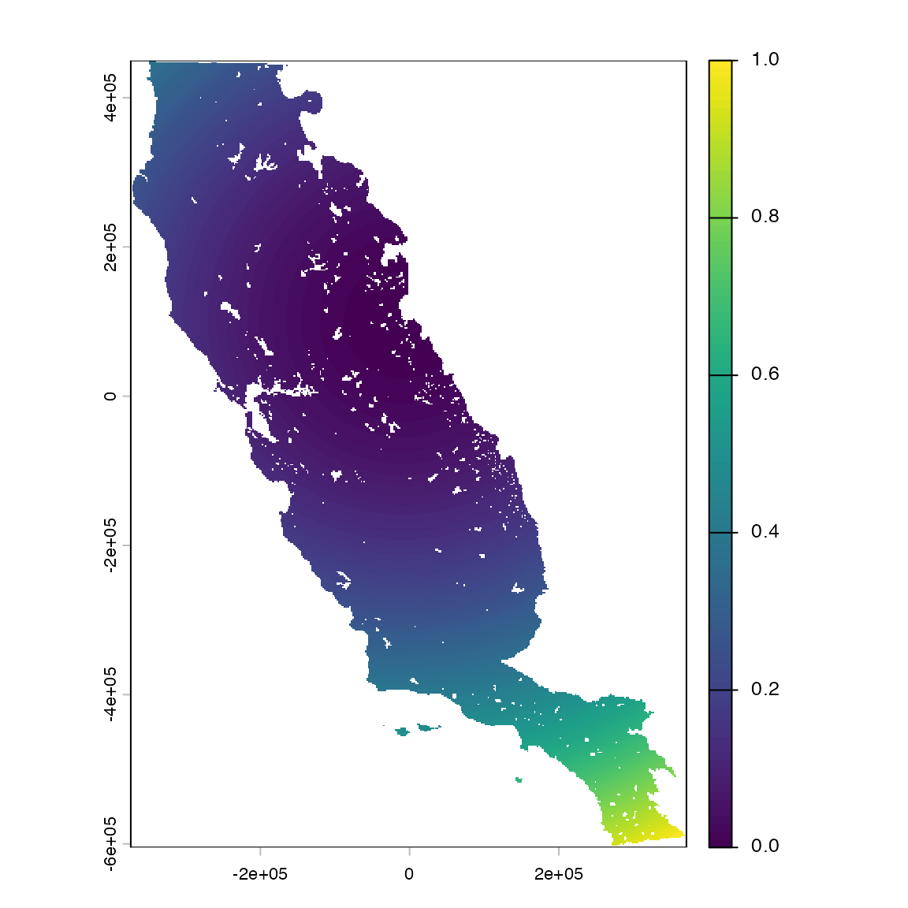

\
\
`# Explore the object. This method assumes that pixels closer to presences are likely included in species distributions. The results is a raster layer containing the sum of euclidean geographic distances from each pixel to all occurrences of a species.`\
`m_cml`\
`#> class       : SpatRaster`\
`#> size        : 558, 394, 1  (nrow, ncol, nlyr)`\
`#> resolution  : 1890, 1890  (x, y)`\
`#> extent      : -373685.8, 370974.2, -604813.3, 449806.7  (xmin, xmax, ymin, ymax)`\
`#> coord. ref. : +proj=aea +lat_0=0 +lon_0=-120 +lat_1=34 +lat_2=40.5 +x_0=0 +y_0=-4000000 +datum=NAD83 +units=m +no_defs`\
`#> source(s)   : memory`\
`#> varname     : somevar`\
`#> name        : msdm_cml`\
`#> min value   :        0`\
`#> max value   :        1`

### 7. Methods to correct overprediction of species distribution models based on occurrences and suitability patterns

These methods are designed to reduce overprediction of species
distribution models based on an a posteriori method (see Mendes et al
2020), i.e., the combination of the patterns of species occurrences and
predicted suitability.

First, prepare the data

\
[`library`](https://rdrr.io/r/base/library.html)`(`[`dplyr`](https://dplyr.tidyverse.org)`)`\
[`library`](https://rdrr.io/r/base/library.html)`(`[`terra`](https://rspatial.org/)`)`\
\
[`data`](https://rdrr.io/r/utils/data.html)`(``"spp"``)`\
`somevar`` ``<-`` `[`system.file`](https://rdrr.io/r/base/system.file.html)`(``"external/somevar.tif"``, package ``=`` ``"flexsdm"``)`\
`somevar`` ``<-`` ``terra``::`[`rast`](https://rspatial.github.io/terra/reference/rast.html)`(``somevar``)`\
\
`# Prepare data for modeling a species`\
[`set.seed`](https://rdrr.io/r/base/Random.html)`(``10``)`\
`occ`` ``<-`` ``spp`` `[`%>%`](https://magrittr.tidyverse.org/reference/pipe.html)\
`  ``dplyr``::`[`filter`](https://dplyr.tidyverse.org/reference/filter.html)`(``species`` ``==`` ``"sp2"``)`` `[`%>%`](https://magrittr.tidyverse.org/reference/pipe.html)` ``# filter using only sp2`\
`  `[`sdm_extract`](https://sjevelazco.github.io/flexsdm/reference/sdm_extract.md)`(`\
`    data ``=`` ``.``,`\
`    x ``=`` ``"x"``,`\
`    y ``=`` ``"y"``,`\
`    env_layer ``=`` ``somevar``,`\
`    filter_na ``=`` ``TRUE`\
`  ``)`` `[`%>%`](https://magrittr.tidyverse.org/reference/pipe.html)` ``# extract variables values from the raster layer`\
`  `[`part_random`](https://sjevelazco.github.io/flexsdm/reference/part_random.md)`(``.``, pr_ab ``=`` ``"pr_ab"``, method ``=`` `[`c`](https://rdrr.io/r/base/c.html)`(``method ``=`` ``"kfold"``, folds ``=`` ``10``)``)`` ``# add columns with partition`\
`#> 6 rows were excluded from database because NAs were found`

Next, we fit and predict a model

\
`m_glm`` ``<-`` `[`fit_glm`](https://sjevelazco.github.io/flexsdm/reference/fit_glm.md)`(`\
`  data ``=`` ``occ``,`\
`  response ``=`` ``"pr_ab"``,`\
`  predictors ``=`` `[`names`](https://rspatial.github.io/terra/reference/names.html)`(``somevar``)``,`\
`  partition ``=`` ``".part"``,`\
`  thr ``=`` ``"equal_sens_spec"``,`\
`)`\
`#> Formula used for model fitting:`\
`#> pr_ab ~ CFP_1 + CFP_2 + CFP_3 + CFP_4 + I(CFP_1^2) + I(CFP_2^2) + I(CFP_3^2) + I(CFP_4^2)`\
`#> Replica number: 1/1`\
`#> Partition number: 1/10`\
`#> Partition number: 2/10`\
`#> Partition number: 3/10`\
`#> Partition number: 4/10`\
`#> Partition number: 5/10`\
`#> Partition number: 6/10`\
`#> Partition number: 7/10`\
`#> Partition number: 8/10`\
`#> Partition number: 9/10`\
`#> Partition number: 10/10`

Next, let’s predict this model and plot it in a map

\
`# Predict this model`\
`m_pred`` ``<-`` `[`sdm_predict`](https://sjevelazco.github.io/flexsdm/reference/sdm_predict.md)`(`\
`  models ``=`` ``m_glm``,`\
`  pred ``=`` ``somevar``,`\
`  thr ``=`` ``NULL``,`\
`  con_thr ``=`` ``FALSE`\
`)`\
`#> Predicting individual models`\
\
`# Predicting individual models`\
[`plot`](https://rspatial.github.io/terra/reference/plot.html)`(``m_pred``[[``1``]``]``)`

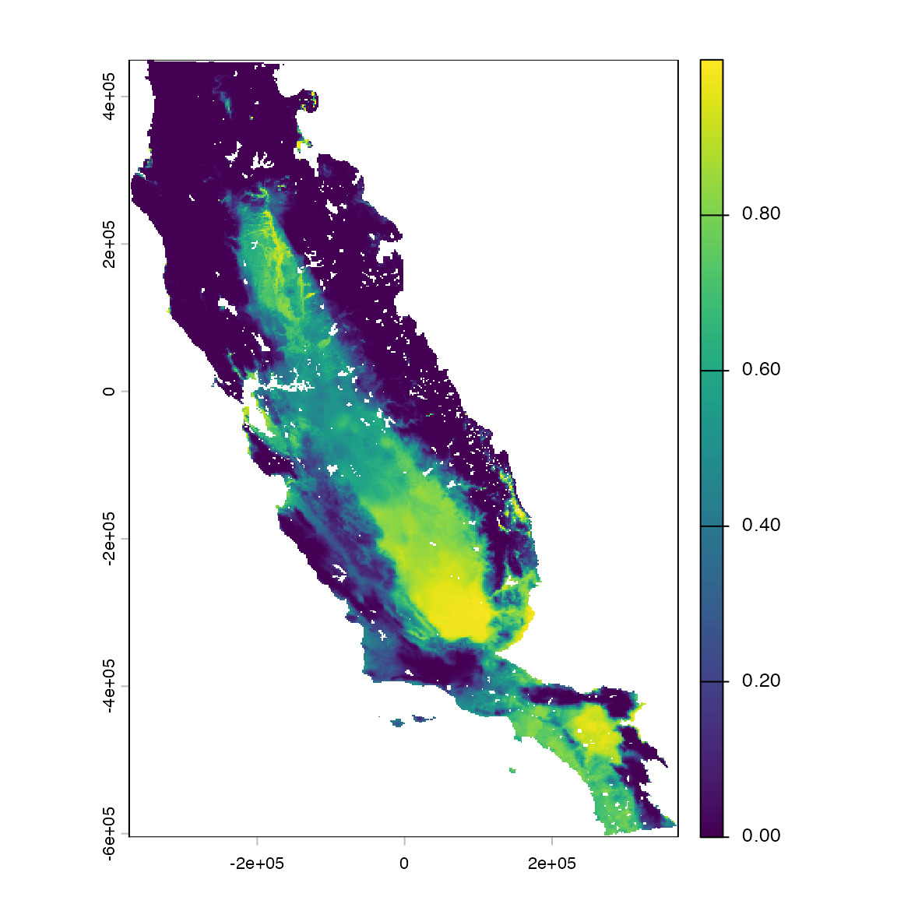

Finally, perform correction to avoid models overpredictions.

\
`# Using mcp method. The Minimum Convex Polygon (mcp) method excludes from SDMs climate suitable pixels that do not intercept a minimum convex polygon, with interior angles smaller than 180, enclosing all occurrences of a species.`\
`m_mcp`` ``<-`` `[`msdm_posteriori`](https://sjevelazco.github.io/flexsdm/reference/msdm_posteriori.md)`(`\
`  records ``=`` ``occ``,`\
`  x ``=`` ``"x"``,`\
`  y ``=`` ``"y"``,`\
`  pr_ab ``=`` ``"pr_ab"``,`\
`  method ``=`` ``"mcp"``,`\
`  cont_suit ``=`` ``m_pred``[[``1``]``]``,`\
`  thr ``=`` ``"equal_sens_spec"``,`\
`  buffer ``=`` ``NULL`\
`)`\
\
[`plot`](https://rspatial.github.io/terra/reference/plot.html)`(``m_mcp``)`

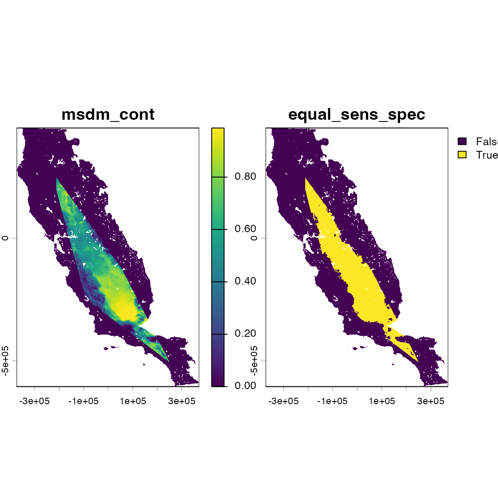

\
\
`# Using bmcp method. The Buffered Minimum Convex Polygon (bmcp) method is similar to the 'mcp' except by the inclusion of a buffer zone surrounding minimum convex polygons.`\
`m_bmcp`` ``<-`` `[`msdm_posteriori`](https://sjevelazco.github.io/flexsdm/reference/msdm_posteriori.md)`(`\
`  records ``=`` ``occ``,`\
`  x ``=`` ``"x"``,`\
`  y ``=`` ``"y"``,`\
`  pr_ab ``=`` ``"pr_ab"``,`\
`  method ``=`` ``"bmcp"``,`\
`  cont_suit ``=`` ``m_pred``[[``1``]``]``,`\
`  thr ``=`` ``"equal_sens_spec"``,`\
`  buffer ``=`` ``30000``,`\
`  crs ``=`` `[`crs`](https://rspatial.github.io/terra/reference/crs.html)`(``m_pred``[[``1``]``]``)`\
`)`\
\
[`plot`](https://rspatial.github.io/terra/reference/plot.html)`(``m_bmcp``)`

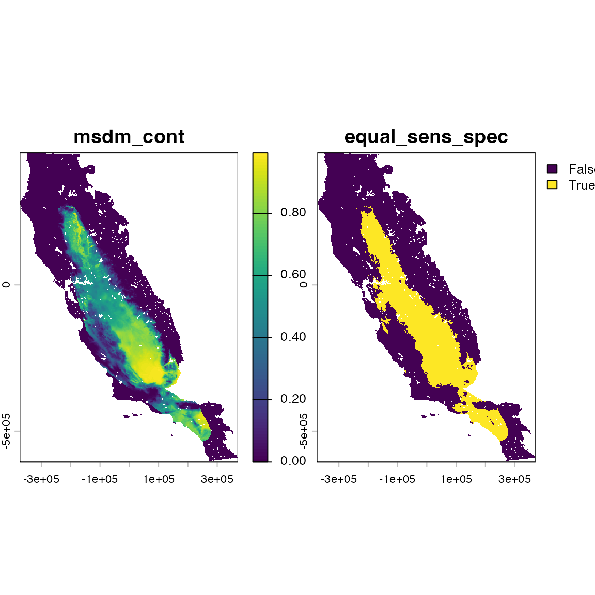

\
\
`# Using obr method. The Occurrences Based Restriction (obr) method assumes that suitable patches intercepting species occurrences are more likely a part of species distributions than suitable patches that do not intercept any occurrence.`\
`m_obr`` ``<-`` `[`msdm_posteriori`](https://sjevelazco.github.io/flexsdm/reference/msdm_posteriori.md)`(`\
`  records ``=`` ``occ``,`\
`  x ``=`` ``"x"``,`\
`  y ``=`` ``"y"``,`\
`  pr_ab ``=`` ``"pr_ab"``,`\
`  method ``=`` ``"obr"``,`\
`  cont_suit ``=`` ``m_pred``[[``1``]``]``,`\
`  thr ``=`` ``"equal_sens_spec"``,`\
`  buffer ``=`` ``NULL`\
`)`\
\
[`plot`](https://rspatial.github.io/terra/reference/plot.html)`(``m_obr``)`

\
\
`# Using pres method. The only occurrences based restriction (pres) method only retains those pixels in suitability patches intercepting occurrences.`\
`m_pres`` ``<-`` `[`msdm_posteriori`](https://sjevelazco.github.io/flexsdm/reference/msdm_posteriori.md)`(`\
`  records ``=`` ``occ``,`\
`  x ``=`` ``"x"``,`\
`  y ``=`` ``"y"``,`\
`  pr_ab ``=`` ``"pr_ab"``,`\
`  method ``=`` ``"pres"``,`\
`  cont_suit ``=`` ``m_pred``[[``1``]``]``,`\
`  thr ``=`` ``"equal_sens_spec"``,`\
`  buffer ``=`` ``NULL`\
`)`\
\
[`plot`](https://rspatial.github.io/terra/reference/plot.html)`(``m_pres``)`

\
\
`# Using lq method. The Lower Quantile (lq) method works whenever a suitable pixel is within a k patch, i.e., not within this lower quartile, the suitability of the pixel is reduced to zero. This means that 75% of k patches were withdrawn from the model.`\
`m_lq`` ``<-`` `[`msdm_posteriori`](https://sjevelazco.github.io/flexsdm/reference/msdm_posteriori.md)`(`\
`  records ``=`` ``occ``,`\
`  x ``=`` ``"x"``,`\
`  y ``=`` ``"y"``,`\
`  pr_ab ``=`` ``"pr_ab"``,`\
`  method ``=`` ``"lq"``,`\
`  cont_suit ``=`` ``m_pred``[[``1``]``]``,`\
`  thr ``=`` ``"equal_sens_spec"``,`\
`  buffer ``=`` ``NULL`\
`)`\
\
[`plot`](https://rspatial.github.io/terra/reference/plot.html)`(``m_lq``)`

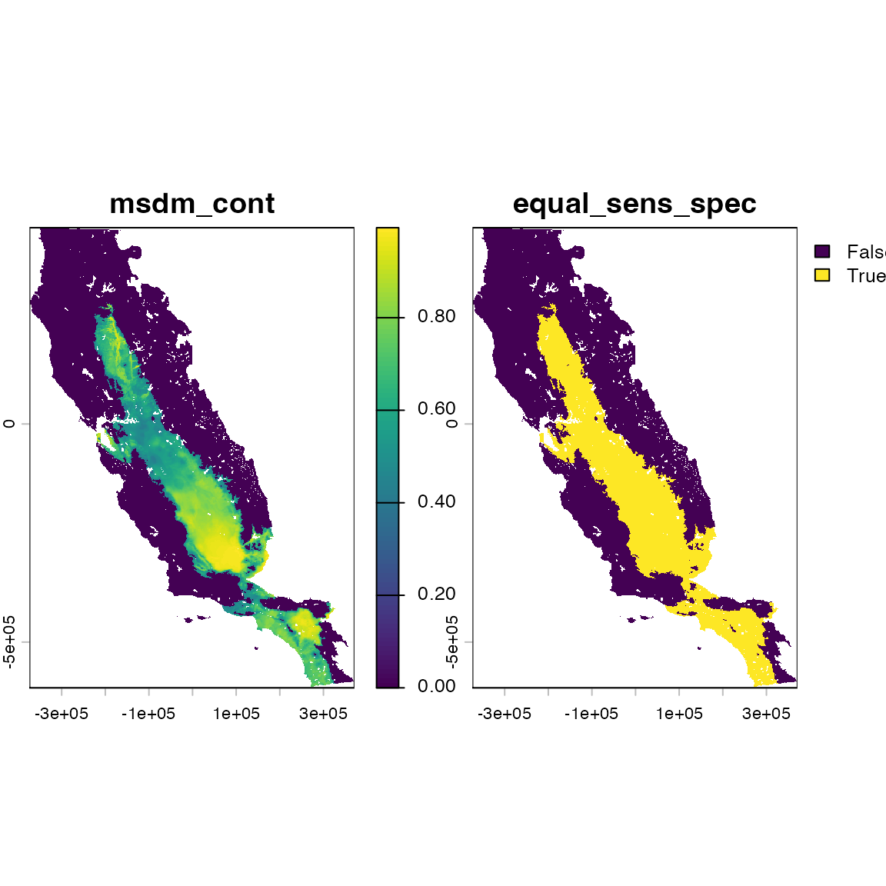
